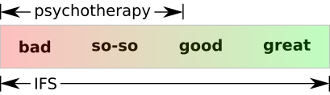

{.center}

Credit: Midjourney "multitude of stories within the head"
{.center}

{}

My goal is to empower you to have more access to calm, confidence,
courage, clarity, and connection. I use **Internal Family Systems**
(IFS). IFS is an [evidence-based](https://www.foundationifs.org/news-articles/79-ifs-an-evidence-based-practice) mode of counseling that has been
proven to heal many forms of psychological suffering.

IFS is a full range modality. Most psychotherapy aims to help people
get from ‘bad’ to ‘so-so,’ or from ‘so-so’ to ‘good’. IFS can also
help people get from ‘good’ to ‘great’. IFS is a [trauma-informed](https://www.verywellmind.com/trauma-informed-therapy-definition-and-techniques-5209445) model.

<--->

{}

## Areas of Expertise

{}

- Emotional & relationship issues
  - I use Internal Family Systems! [IFS is similar to psychotherapy, addressing many of the same conditions.]()
  - I provide *counseling* under [ORS 675.825(4)(a)](https://oregon.public.law/statutes/ors_675.825), which allows alternative counselors to practice legally in Oregon without a license.

- Psychedelic prep & integration
  - Prepare to take your first psychedelic journey safely
  - Understand and integrate your psychedelic journey(s)
  - I do **not** prescribe, procure, or administer substances.

<--->

- Expecting your first child?
  - Ready for a new full-time job without sleep? Learn the mental health tools you need **before** the proverbial shit hits the fan.
  - If you put more skill and effort into the first three years, you and your child will reap a lifetime of benefits.
- Lifestyle, nutrition, & physical health
  - I have studied nutrition for many years and am trained to evaluate statistical evidence.
  - I am **not** a licensed dietician.[^capture-of-nutrition]
  - I am **not** a medical doctor.

{}

## Professional Background

- Ph.D. Quantitative Psychology in 2016 from University of
Virginia. See [NCBI](https://www.ncbi.nlm.nih.gov/sites/myncbi/1JSuQtfn5RykSS/bibliography/56367505/public/?sort=date&direction=ascending) for publications.
- Practicing meditation for more than 30 years. Can provide cult recovery support.
- Evaluator-participant in 16-hour [MAPS](https://maps.org/) psychedelic education course.
- IFS Level 1 [completed Nov 2022](https://ifs-institute.com/practitioners/all/110287). IFS Continuity Program subscriber since Sep 2022. Working toward [IFS Certification](https://ifs-institute.com/trainings/ifs-certification).
- Since I am **not** licensed in Oregon, I cannot describe myself as a *psychotherapist*. [ORS 675.020](https://oregon.public.law/statutes/ors_675.020)

## What does counseling look like?

As a default, I recommend 75-minute sessions on a weekly basis. However,
other schedules can be accommodated.
The duration of therapy can vary depending on your needs and motivation.
During the no-fee consultation, we’ll decide together what is the best fit.

{}

## Location

I live in White City, Oregon (near the California border).

I am seeing clients by video or audio-only[^audio-only] (your choice).

As I am not licensed, I can work with anyone, anywhere in the world.

<--->

## Fees

My rate is $120 per hour. Reserve time in 15 min increments. I do not accept insurance.

People with low income, or veterans or active military may request a sliding scale rate.

Book a free 20 min consultation.

<!-- ScheduleOnce button START -->
<button id="SOIBTN_jpintro" style="background: #006DAF; color: #ffffff; padding: 10px 20px; border: 1px solid #c8c8c8; font: bold 14px Arial; cursor: pointer;" data-height="580" data-psz="00" data-so-page="jpintro" data-delay="1">Schedule an Appointment</button>

<!-- ScheduleOnce button END -->

{}

## Silly Photos

<table>
<tr>
<td>
<picture style="display: block;">
    <source media="(min-width: 1320px)" srcset="line-up-1280.png">
    <source media="(min-width: 840px)" srcset="line-up-800.png">
    
</picture>
</td>
<td class='rotate'>
Dec 2019
</td>
</tr></table>

## Notes

[^capture-of-nutrition]: Is it probably a good thing that I am not a licensed dietician given [The corporate capture of the nutrition profession in the USA: the case of the Academy of Nutrition and Dietetics (2022)](https://www.cambridge.org/core/journals/public-health-nutrition/article/corporate-capture-of-the-nutrition-profession-in-the-usa-the-case-of-the-academy-of-nutrition-and-dietetics/9FCF66087DFD5661DF1AF2AD54DA0DF9).

[^audio-only]: In the classical approach to psychotherapy, the client lies on a couch and does not look the therapist directly in the eye while speaking.
