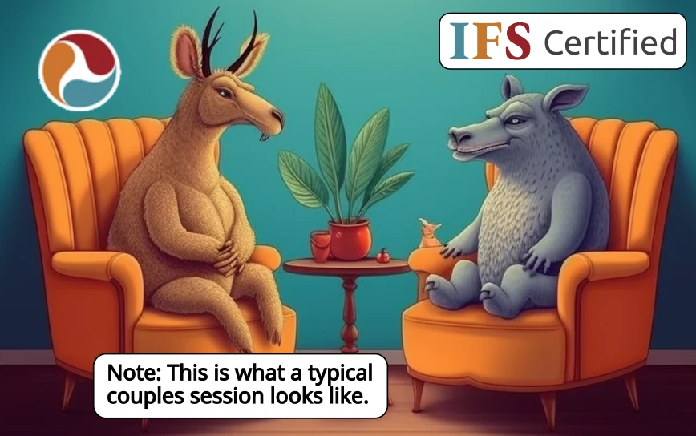

  
New Book

  
<em>Religion Unburdened by Belief:</em>

  
<em>The Way of Open Inquiry</em>

  
Releasing June 15, 2026

  <a href="https://unburdened.biz" style="display:inline-block;background:#ffd700;color:#1a3a6b;font-weight:700;font-size:0.9rem;padding:0.45rem 1.25rem;border-radius:20px;text-decoration:none;letter-spacing:0.03em">Learn More →</a>

Credit: Midjourney
{.center}

We offer a serene and confidential environment to talk about matters of the heart. 💖

Our goal is to help you reprocess your psychological pain and suffering in a way that releases any detrimental limits on love, contentment, and positive self-concept (🤪 and 😬 → 😇).

We use **Internal Family Systems** (IFS). IFS is an [evidence-based](https://www.foundationifs.org/research/evidence) and [trauma-informed](https://www.verywellmind.com/trauma-informed-therapy-definition-and-techniques-5209445) model. 

Traditional talk therapy puts therapists in an expert role. They diagnose problems, suggest solutions, teach coping skills, and interpret clients' dreams and behaviors. But IFS therapists serve as guides who help clients access their own inner healer. Clients learn to access their *Self* rather than relying on the therapist to fix problems. They build relationships with different parts of their personality by turning inward.

 

{.center}
