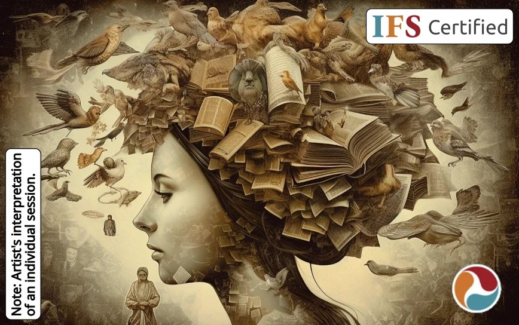

Credit: Midjourney
{.center}

I offer a serene and confidential environment to talk about matters of the heart. 💖

My goal is to help you reprocess your psychological pain and suffering in a way that releases any detrimental limits for love, contentment, and positive self-concept (🤪 and 😬 → 😇).

I use **Internal Family Systems** (IFS). IFS is an [evidence-based](https://www.foundationifs.org/research/empirical-evidence) and [trauma-informed](https://www.verywellmind.com/trauma-informed-therapy-definition-and-techniques-5209445) model. 

## Areas of Expertise

{}
- [IFS is similar to psychotherapy, addressing many of the same conditions.]()
- I provide *counseling* under [ORS 675.825(4)(a)](https://oregon.public.law/statutes/ors_675.825), which allows alternative counselors to practice legally in Oregon without a license.
- Since I am **not** licensed in Oregon, I cannot describe myself as a *psychotherapist*. [ORS 675.020](https://oregon.public.law/statutes/ors_675.020)
{}
{}
- Prepare to take your first psychedelic journey safely[^morgan2020]
- Understand and integrate your psychedelic journey(s)
- I do **not** prescribe, procure, or administer substances.
{}
{}
- I have studied [nutrition]() for many years and am trained to evaluate statistical evidence.
- I am **not** a licensed dietician.[^capture-of-nutrition]
- I am **not** a medical doctor.
{}

## Education

{}
| Date | Description |
|------|-------------|
| 2024 Jul | [IFS Certified Practitioner]() |
| 2024 Feb | IFS and Past Lives with Bob Falconer |
| 2023 Dec | [Common Stuck Points](https://burriscounseling.com/) |
| 2023 Nov | IFIO Advanced Training: Sexuality Matters |
| 2023 Aug | [Creating Healing Circles](https://burriscounseling.com): Using the IFS Model in Group Therapy |
| 2023 Jun | [Intimacy from the Inside Out](https://www.toniherbineblank.com/trainings.html) (IFIO) relationship therapy Basic Training (IFS Level 2) |
| 2022 Nov | IFS Level 1 🍀🚀 |
| 2022 Sep to present | [IFS Continuity Program](https://learn.ifs-institute.com/ifs-continuity-program/) |
{}
{}
- Check out my [2023 article on meditation](https://partsandself.org/ifs-and-meditation/) published in the IFS magazine PARTS & SELF!
- Can provide cult recovery support.
{}
{}
- See [NCBI](https://www.ncbi.nlm.nih.gov/sites/myncbi/1JSuQtfn5RykSS/bibliography/56367505/public/?sort=date&direction=ascending) for publications.
{}

 

{.center}

## Silly Photos

<table>
<tr>
<td>
<picture style="display: block;">
    <source media="(min-width: 1320px)" srcset="line-up-1280.png">
    <source media="(min-width: 840px)" srcset="line-up-800.png">
    
</picture>
</td>
<td class='rotate'>
Dec 2019
</td>
</tr></table>

## Notes

[^capture-of-nutrition]: Is it probably a good thing that I am not a licensed dietician given [The corporate capture of the nutrition profession in the USA: the case of the Academy of Nutrition and Dietetics (2022)](https://www.cambridge.org/core/journals/public-health-nutrition/article/corporate-capture-of-the-nutrition-profession-in-the-usa-the-case-of-the-academy-of-nutrition-and-dietetics/9FCF66087DFD5661DF1AF2AD54DA0DF9).

[^morgan2020]: Morgan, N. L. (2020). Integrating psychedelic experiences utilizing the Internal Family Systems therapeutic model. *Int. J. Soc. Sci. Manage. Rev 3,* 257–264. doi: [10.37602/IJSSMR.2020.3417](http://ijssmr.org/uploads2020/ijssmr03_123.pdf)
