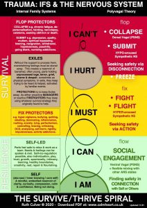
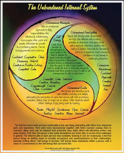

# Internal Family Systems

## [No Bad Parts: Healing Trauma and Restoring Wholeness with the Internal Family Systems Model](https://ifs-institute.com/store/419)

Is there just one “you”? We’ve been taught to believe we have a single identity, and to feel fear or shame when we can’t control the inner voices that don’t match the ideal of who we think we should be. Yet Dr. Richard Schwartz’s research now challenges this “mono-mind” theory. “All of us are born with many sub-minds—or parts,” says Dr. Schwartz. “These parts are not imaginary or symbolic. They are individuals who exist as an internal family within us—and the key to health and happiness is to honor, understand, and love every part.”

Dr. Schwartz’s Internal Family Systems (IFS) model has been transforming psychology for decades. With No Bad Parts, you’ll learn why IFS has been so effective in areas such as trauma recovery, addiction therapy, and depression treatment—and how this new understanding of consciousness has the potential to radically change our lives. Here you’ll explore:

- The IFS revolution—how honoring and communicating with our parts changes our approach to mental wellness
- Overturning the cultural, scientific, and spiritual assumptions that reinforce an outdated mono-mind model
- The ego, the inner critic, the saboteur—making these often-maligned parts into powerful allies
- Burdens—why our parts become distorted and stuck in childhood traumas and cultural beliefs
- How IFS demonstrates human goodness by revealing that there are no bad parts
- The Self—discover your wise, compassionate essence of goodness that is the source of healing and harmony
- Exercises for mapping your parts, accessing the Self, working with a challenging protector, identifying each part's triggers, and more 

IFS is a paradigm-changing model because it gives us a powerful approach for healing ourselves, our culture, and our planet. As Dr. Schwartz teaches, “Our parts can sometimes be disruptive or harmful, but once they’re unburdened, they return to their essential goodness. When we learn to love all our parts, we can learn to love all people—and that will contribute to healing the world.”

{}

## Survive Thrive Spiral Poster

[Download](https://calmheart.co.uk/resources/)

<--->

## The Unburdened System Poster

[Download](https://www.marielpastor.com/the-unburdened-system)

{}

## Character Mapping: A Psychological Toolbox and Master Class for Actors, Writers, and Directors

Initially launched in 2017 by Mariel Pastor, and seemingly will be relaunching soon:

- [https://www.character-mapping.com/](https://www.character-mapping.com/)
- [https://www.youtube.com/channel/UCBgeVPlMbWzMAxHHIsDieow](https://www.youtube.com/channel/UCBgeVPlMbWzMAxHHIsDieow)

