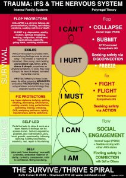
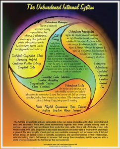

# Internal Family Systems

## Eleven minute primer



Note: Audio is very faint for the first minute.

{}

## Survive Thrive Spiral Poster

[Download](https://calmheart.co.uk/resources/)

<--->

## The Unburdened System Poster

[Download](https://www.marielpastor.com/the-unburdened-system)

{}

 

Ready to experience IFS for yourself? The first step is a free 20-minute conversation.

<form><input class="glowing" type="button" onclick="window.open('https://joshua-pritikin.clientsecure.me/request/service', '_blank')" value="Book a Free Consultation" /></form>

