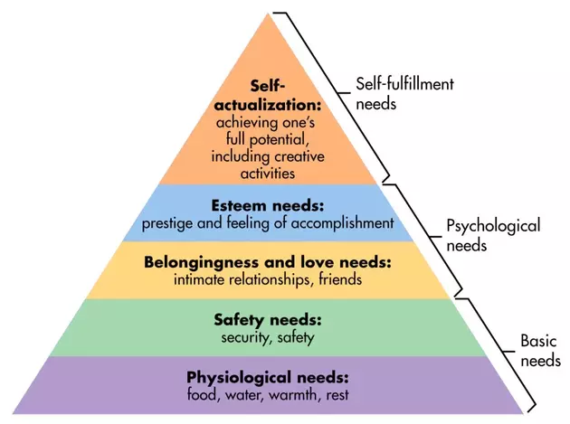

# Meditation

## What is meditation?

To try to answer this question, I have studied the contemplative
traditions of many of the world's major religions. For example,

{}

- Christianity ✝️
- Islam ☪️
- Hinduism 🕉️

<--->

- Buddhism (Vajrayāna, Mahāyāna, & Zen)
- Daoism (Taoism) ☯️
- Judaism 🕎

{}

I have also studied with a handful of contemporary meditation
teachers.[^lenz] What I learned is that there is not much consensus about the
precise definition of *meditation*. I prefer to define meditation in
IFS terms:


Meditation becomes possible when you are not identified with your
parts. Meditation occurs when some proportion of your being is
free to radiate Self energy.


In some traditions, there is a notion of *enlightenment* or
*liberation* that demarcates some stage of personal transformation.
However, we should not be satisfied with personal transformation of any degree;
The appropriate benchmark for attainment is global, societal transformation.
Everybody should have the opportunity to climb Maslow's pyramid.

## Meditation Techniques

Meditation is more like a dance than a desk lamp 🪔. There are moves to learn.
The techniques that I describe in sub-sections assume that you are already
proficient in meditation. Without a basic competence in
[effortless meditation](),
you may not obtain any benefit from these techniques. Moreover, these
techniques may not work when under the influence of psychedelics.

### On breathing

Use an inspiratory muscle training device to improve your breathing mechanics.

The only meditation technique that I am familiar with is [here]().

### On mantras, prayers, poetry, music

In a solo context, there is potential for spiritual bypass. A
mantra recited vigorously can pave over and hide unaddressed parts with
unaddressed issues that would otherwise be in dialog filling your head
with thoughts. Suppression is not a good long-term strategy.

In a group context, prayers and music can help synchronize individuals
and invite communitas.[^turner2012]

### Timing

The best time to practice meditation is 4:30 to 9:00 (am and pm) in your local time zone.

### Sample Schedule

| When | Activity | Duration |
| ---- | -------- | -------- |
| morning | drink green tea 🍵 | - |
|      | [withdrawal of the senses]() | 10 min |
|      | [sahasrara]() | 5-10 min |
| lunch | eat calmly and undistracted[^lunch] | - |
| before dinner | [foot soak]() \& [withdrawal of the senses]() | 15 min |
|      | [sahasrara]() | 10 min |
| after dinner | [kanna extract]() | - |
| before sleep | [ice on the liver]() | 15 min |

{}
- Use 300-600mg per day. Capsaicin acts as a relaxing analgesic for [TRPV1](https://en.wikipedia.org/wiki/TRPV1) in the colin.[^bortolotti2011]
- Serotonin is one of the main neurotransmitters involved in both meditation and psychedelics.[^serotonin2017] Serotonin receptors are widely expressed within the gastrointestinal tract.[^mawe2013] (This is suggestive of some kind of causal relationships.)
- You might take cayenne with morning tea.[^morré2003]
- Avoid cayenne pepper on an empty stomach 🧨🔥.
{}

This is just a sample schedule. Customize as per your preference.

### Don't forget fun

Check out [JP Sears](https://en.wikipedia.org/wiki/JP_Sears)'s collection of parodies [Ultra Spiritual Life](https://www.youtube.com/playlist?list=PLVqOKx7e2qhefIG5IEGOKQ4pCzFf8IScX).

## References

[^lenz]: Among others, I was a student of [Rama a.k.a. Frederick Lenz](https://fredericklenz.com/) for a few years. For a retrospective, check out the associated [Smoke Screen Podcast](https://www.neonhum.com/show-pages/i-am-rama.html).

[^turner2012]: Turner, E. (2012). *Communitas: The anthropology of collective joy.* Springer.

[^lunch]: Calm and undistracted meals are generally a good idea, but particularly important for lunch.

[^bortolotti2011]: Bortolotti, M., & Porta, S. (2011). Effect of red pepper on symptoms of irritable bowel syndrome: Preliminary study. *Digestive Diseases and Sciences, 56*(11), 3288–3295. https://doi.org/10.1007/s10620-011-1740-9

[^morré2003]: Morré, D. J., & Morré, D. M. (2003). Synergistic Capsicum-tea mixtures with anticancer activity. *The Journal of Pharmacy and Pharmacology, 55*(7), 987–994. https://doi.org/10.1211/0022357021521

[^mawe2013]: Mawe, G. M., & Hoffman, J. M. (2013). Serotonin signalling in the gut--functions, dysfunctions and therapeutic targets. *Nature Reviews Gastroenterology & Hepatology, 10*(8), 473–486.

[^serotonin2017]: Carhart-Harris, R. L., & Nutt, D. J. (2017). Serotonin and brain function: a tale of two receptors. *Journal of Psychopharmacology (Oxford, England), 31*(9), 1091-1120.
