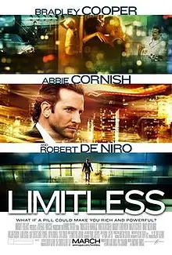
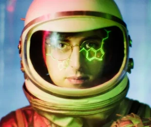

## Psychoactive Drugs

{}
We hold these truths to be self-evident, that all men are created equal, that they are endowed by their Creator with certain unalienable Rights, that among these are Life, Liberty and **the pursuit of Happiness**.
{}

### On drug (mis)regulation 🚧

{}
Nora D. Volkow, MD, is Director of the National Institute on Drug Abuse (NIDA) at the National Institutes of Health

https://www.youtube.com/watch?v=v1zVAOdzynk&t=2383s

From 39:45

Tim Ferriss: there's so many incidental or accidental ways
to ingest, for example, fentanyl.  And I know of many direct stories,
where people have gone to a bachelor  party, they try a little bit of some drug,   that ends up being cut with fentanyl. I know of  two people specifically. One just dropped dead on
the floor. One fell into a coma from what would've  been considered low doses of illicit drugs. But
they happened to be cut with fentanyl, which is  horrifying. And in fact, my friend who died was
not himself an addict. He was collateral damage. One of my other friends I grew up with,
there are a lot of drug issues where I grew up,  was a heroin addict. He had developed just an
incredible tolerance to fentanyl, and he gave it  to my other friend to help with his hangover. And
my other friend had never used any opiates, and he  fell asleep and just never woke up. So the sheer
ease with which the fentanyl, as you mentioned,  sort of permeates different corners and
neighborhoods of society, which does not  discriminate in terms of — or I shouldn't say
it doesn't discriminate, but it has infiltrated  every socioeconomic class. It's really pervasive
and really terrifying. What is your perspective  on the War on Drugs and perhaps any other
approaches that you think may be more effective?

Dr. Nora Volkow: Yeah. And I'll answer it, but I guess actually the story that you just told  of your friend that how he'd be taking fentanyl
unbeknowing what it was, it just killed him. And  this is what we are observing a lot. And I think
it's important to educate people that this is  a seriously dangerous drugs. And unfortunately,
I think that we have cried wolf so many,  many times that we've lost credibility. 
But if there was a way that we could convey  that in very objective, we don't need to
exaggerate in any way. I mean fentanyl, two  milligrams will kill you. And the counterfeit
pills contain five milligrams, some of them two  doses to kill you. So it is very, very tragic. 
But coming back to your question in  terms of the War on Drugs, I think that
basically what it did was it created a mechanism  that could perpetuate structural racism. It is
very tragic to see how its enforcement led to  the incarceration of young black Americans. 
And again, that punitive system where someone  could be stopped, and this will happen if you are
black and on the notion that you had drugs with  you and thrown in jail or prison because you had
drugs on you is such an unfair system. And it  didn't work in any way because it did not reduce
the amount of drugs that people were taking or  the negative consequences of drugs to our society.
So it did not work. And I think, and too, I mean one   of the aspects that it did show is if you do  throw a person that's taking drugs in jail,
if you criminalize that person that's  using drugs, for example, when we did   horribly with crack cocaine. So if you  were smoking crack cocaine, it was like,
I don't recall exactly, but it was at least 10  times greater than if you were just snorting
cocaine. Snorting cocaine or injecting cocaine  hydrochloride was much more favored by white
people. Whereas crack was favored by black people. So cocaine hydrochloride, white, crack cocaine,
black. Why do you see such a difference? It's  the same cocaine, basically. Cocaine is cocaine,
and yet one could note a much higher penalty than  the other. That's an example of the consequences. 
But what science has shown is that when you do  throw people into jail or prisons that have a
problem with substance use disorders, then when  they leave, they are at much greater risk of,
first of all, relapsing immediately into the  drug taking and escalating their drug taking.
So you are exacerbating the nature of the  problem by putting them in jail and prison.  So it doesn't work no matter what you do. And  that's why the whole notion of criminalizing
the person that takes drugs is basically very  negative vis-a-vis the outcomes of the person
and also in no way it benefits society,  it is actually very costly by itself.
When an issue becomes politicized, then it  becomes much harder to change and shift. 
And we've seen, I think, that we've  seen over the past, I would say,
certainly, five or eight years, an openness to  recognizing that the War on Drugs did not work
and that criminalizing drug users is basically  negative and it's promoting structural racism. 
{}

{}

Nutt, D. J., King, L. A., & Phillips, L. D. (2010). Drug harms in the UK: a multicriteria decision analysis. *The Lancet, 376*(9752), 1558-1565.

{}

Also check out:
- [One sane reform proposal](https://maps.org/bulletin-criminal-legal-system-reform-healthier-society/)
- Parody [Drug Dealers Against Legalization](https://jpritikin.github.io/ddal/) and the grave menace of equasy[^equasy] 🐎

### My experience 👋🏼

I am a sincere religious practitioner[^chacruna2021] who is a member of
- [Santo Daime](https://en.wikipedia.org/wiki/Santo_Daime)[^catholic]
  
  
Me with [Padrinho Jonathan Goldman](https://casetext.com/case/church-of-holy-light-of-queen-v-mukasey-2)  

- [Church of Sacred Synthesis](https://thesacredsynthesis.com/)
- [Sacred Garden Church](https://sacredgarden.life/); I love the notion of "least dogma!"[^carse2009]
- [PSILO Temple](https://psilotemple.org/)

I have first-hand experience with

*   Psilocybin 🍄
*   Salvia divinorum
*   Cannabis
*   Daime (a.k.a. ayahuasca) 🍵
*   Piper methysticum a.k.a. [kava](https://www.kavacoalition.org/blog/introduction-to-kavalactones-part-1) ([kavain, dihydrokavain](https://www.kavacoalition.org/blog/introduction-to-kavalactones-part-2), [methysticin, dihydromethysticin](https://www.kavacoalition.org/blog/introduction-to-kavalactones-part-3), [yangonin, and desmethoxyyangonin](https://www.kavacoalition.org/blog/introduction-to-kavalactones-part-4)). Probably safer than hypnotics?[^kripke2012]
*   Sceletium tortuosum (kanna)
*   Psilomethoxin ([orally active 5-methoxy-N,N-dimethyltryptamine](https://www.youtube.com/watch?v=SeROOGFnwek)) 🐸
*   Mescaline 🌵

### In film 📽️

{}

)
{.center}

<--->

{.center}

Hamilton’s Pharmacopeia
{.center}

{}

## Journey Invitation 🛝

Yes, [why not]()?

### Amplification

Psychedelics are substances that reveal and amplify your inner experience.[^nichols2023]

The subjective sense of psychedelic amplification is the reflection of
a corresponding impairment of working memory.[^healy2021]
However, working memory is not monolithic.
Different psychedelics impair different aspects
of working memory.
[Salvinorin A]() impairs cognitive working memory
much more than emotional working memory.
Serotonergic psychedelics impair emotional working memory
much more than cognitive working memory.

### Can psychedelics help challenge belief systems?

Yes, this is one of their most valuable potential benefits.[^carse2009]

- **Increased Openness**: Psychedelics can loosen rigid thinking patterns, making individuals more receptive to considering viewpoints outside their current framework.
- **Enhance self-reflection:** Increased self-awareness can expose contradictions or limitations within a person's current belief system.
- **A tacit feeling of interconnectedness:** The feeling of being part of something larger can prompt a questioning of self-imposed boundaries, leading to a potential reevaluation of beliefs about oneself and the world.

{}
Psychedelics are not salubrious for everybody.
{}

- Psychedelics don't guarantee a change in beliefs. They can also reinforce existing belief systems, especially if used with that intention.
- There is a potential risk for individuals with already fluid belief systems to lose touch with reality and develop psychosis.

{}
Will psychedelics be salubrious for you?
{}

### Bad trip mythology

A *bad trip* refers to a distressing and challenging experience that can occur when someone takes a psychedelic substance. Characteristics of a bad trip might include:

- **Intense Anxiety and Paranoia**: Individuals may feel extreme fear, unease, or paranoia. This can manifest as a sense that something terrible is about to happen or that they are in danger.
- **Confusion and Disorientation**: A person may become very confused, unable to understand their surroundings, or unable to recognize familiar people or places. They might feel lost or trapped in their own mind.
- **Emotional Distress**: Strong negative emotions such as sadness, hopelessness, or despair can overwhelm the individual. These emotions can feel intense and all-encompassing.
- **Sense of Losing Control**: A person on a bad trip might feel like they are losing control over their thoughts, body, or the situation around them. This loss of control can be very frightening.
- **Physical Discomfort**: While primarily psychological, a bad trip can also involve physical symptoms such as nausea, chills, sweating, or a racing heart.

The likelihood of a bad trip is increased by many factors such as the use of too high a dosage, prior health conditions, lack of preparation, and taking psychedelics in an unsafe or unpredictable environment.
By taking basic precautions and avoiding these known pitfalls, a bad trip becomes much less likely.
Sensationalized accounts of the rare bad trip have made them seem far more common than they actually are.
With a little care, you can be confident of avoiding a bad trip.

A good analogy is food poisoning.
Consuming contaminated food can lead to an unpleasant experience with nausea, indigestion, and diarrhea.
However, people do not live in constant fear of food poisoning.
By washing your hands thoroughly and keeping meat-borne bacteria away from raw foods like salads, the likelihood of getting sick is very low.

{}

Another way to look at it is to compare the distress of a bad trip to the potential harms that law enforcement might inflict. Here are some potential harms ordered from least disruptive to most severe:

Almost always,[^krebs2013] a bad trip is no worse than *arrest without prosecution*.

<--->

1. Stop and search
1. Confiscation of drugs
1. Arrest without prosecution
1. Fines and penalties
1. Short-term detention (e.g., overnight in jail)
1. Criminal charges and prosecution
1. Imprisonment
1. Asset seizure and forfeiture
1. Violence and abuse by law enforcement
1. Extrajudicial actions (e.g., unlawful killings)

{}

{}
In many cases, there exists a legal drug comparable in effect to a desired illegal drug.
Or an illegal drug might be legal in particular contexts.
Law enforcement is almost always[^krebs2013] the most dangerous aspect of drug use.
For you own safety, **don't break the law.**
{}

### Predicting your reaction 🏹

Your reaction to a psychedelic strongly depends on the willingness of your Parts to get quiet.[^aday2021]
See my discussion of [effortless meditation]() to learn more about Parts
and how to help them relax. There are at least three possible outcomes:
- Parts are overactive and not willing to get quiet. A psychedelic will tend to make Parts more loud and extreme. This is going to be a difficult trip and corresponds to the monkey mind of an inexperienced meditator 🐒, magnified to Godzilla size 🦍.[^cheetah]
- Parts are active but willing to get quiet. In this situation, the client gains more access to Self energy and may do Parts work spontaneously. There is the opportunity to make rapid strides toward therapeutic goals.[^ifs-mdma]
- Parts are fairly quiet. The Self shines with unusual brilliance 🌞 because the psychedelic does the bouncer Part’s job, facilitating an experience of Self that is profoundly effortless. Similar to effortless meditation, there is ample capacity for blending with a target. This is readily seen in reports of music perception under the influence of psychedelics. For example, “Volunteers reported far greater absorption in music, as well as greater perceived beauty and significance of music.”[^barrett2018]

Suppose you are curious to try a psychedelic but are not sure whether your Parts will get quiet.
{}
Which psychedelic poses the least risk to the naive user?
{}

### Serotonin Overview

{}

Some of the most popular psychoactive substances operate by modulating the serotonin system.
Serotonin is important because it is, in part, responsible for the regulation of serenity.[^olivier1990]
Serotonin is also known as 5-hydroxytryptamine, or abbreviated, 5-HT.
There are at least 14 different serotonin receptors that allow cells
to respond in various ways to the presence of serotonin. The two most prevalent brain receptors
are known as 1A and 2A (also called 5-HT1A and 5-HT2A).
The figure below shows the function of the two main serotonin receptors.[^serotonin2017]

<--->

{.center}

{}

{.center}

Credit: Carhart-Harris & Nutt, 2017, Figure 3
{.center}

### Serotonin 1A

I suggest that psychedelics that target the 5-HT1A receptor pose the least risk to the naive user.
Until recently, MDMA and 5-MeO-DMT were the popular choices believed to modulate 5-HT1A activity.
5-MeO-DMT directly modulates the 5-HT1A receptor, but MDMA influences it indirectly.
MDMA seems to influence the 5-HT1A receptor by
its ability to release serotonin (biology is complicated[^ray2010]).
The subjective effects of these substances are more or less different, but the main advantage of [psilomethoxin]() is that it is currently unregulated, well suited to low dosages, and [easy to obtain]().

### Cannabis

{}

{.center}
<--->

{.center}
{}

Cannabis offers euphoric, relaxing, and sensitivity-enhancing effects.
The main psychoactive, THC, does not bind to serotonin receptors directly, but influences their activity indirectly.
The simplest way to access cannabis is with Delta-8 THC tincture and CBD distillate.
For example, take 25mg Δ8-THC and 25mg CBD, wait one hour then take 0.5g psilomethoxin.[^cannabis]

{}
Do not take THC without CBD.
The combination of THC and CBD feels completely different than either molecule ingested alone.
{}

The euphoria of cannabis is both an advantage and disadvantage.
Euphoria is great for beginners, but the greater art is in freely shaping emotion.
Once comfortable with cannabis, I suggest exploring other psychedelics like Daime.

### Serotonin 2A

Daime or Ayahuasca, a serotonin 2A agonist, does not spotlight any particular emotion but affectively amplifies in a pure or unbiased way.
Initial use of 5-HT1A psychedelics or cannabis can be seen as preparatory, akin to training wheels.
If 5-HT1A is likened to vanilla ice cream, 5-HT2A offers a vast array of flavors.

Unaided, [effortless meditation]() is precarious in the sense that we can not entertain targets that prompt much Part involvement.
This is where Daime can pick up the slack.
Daime can facilitate Self energy in environments that require effortful participation.
For example, in [Santo Daime]() ceremonies, everybody is expected to sing 🎶 and dance.
It seems unlikely to me that members would often enjoy much Self energy without the help of the psychedelic sacrament.

### On Alan W. Watts 🔬

> If you get the message, hang up the phone. For psychedelic drugs are simply instruments, like microscopes, telescopes, and telephones. The biologist does not sit with eye permanently glued to the microscope, he goes away and works on what he has seen.

**Rebuttal:** I agree with Watts that psychedelics can be powerful tools for self-discovery.
Sometimes, like the biologist stepping away from the microscope, we need to [integrate]() the insights from a trip, incorporating them to our daily lives.
But what about journeys that do not contain a utilitarian message?
Perhaps there is only an altered consciousness.
Like a breathtaking vista, it may not need analysis, just appreciation.
Embracing this beauty with open arms isn't a failure to "get the message" – it's a form of wisdom.
We don't have to be on a constant quest for self-improvement and there's no shame in seeking [help](/#beyond-your-ability-a-helping-hand) to taste the heights of beauty. 🌺

## Notes

[^catholic]: I am a bit embarrassed to be affiliated with Catholicism given its [sordid history](https://en.wikipedia.org/wiki/Catholic_Church). In general, I admire the best of all of the world's religions.

[^serotonin2017]: Carhart-Harris, R. L., & Nutt, D. J. (2017). Serotonin and brain function: a tale of two receptors. *Journal of Psychopharmacology (Oxford, England), 31*(9), 1091-1120.

[^olivier1990]: Olivier, B., & Mos, J. (1990). Serenics, serotonin and aggression. *Progress in clinical and biological research, 361*, 203-230.

[^ifs-mdma]: [MDMA and PTSD STUDIES](https://ifs-institute.com/resources/research/mdma-and-ptsd-studies)

[^barrett2018]: Barrett, F. S., Preller, K. H., & Kaelen, M. (2018). *Psychedelics and music: Neuroscience and therapeutic implications. International Review of Psychiatry, 30*(4), 350-362.

[^ray2010]: Ray, T. S. (2010). *Psychedelics and the human receptorome. PloS One, 5*(2), e9019.

[^aday2021]: Aday, J. S., Davis, A. K., Mitzkovitz, C. M., Bloesch, E. K., & Davoli, C. C. (2021). Predicting reactions to psychedelic drugs: A systematic review of states and traits related to acute drug effects. *ACS Pharmacology & Translational Science, 4*(2), 424-435.

[^nichols2023]: Nichols, D. E., Nichols, C. D., & Hendricks, P. S. (2022). Proposed Consensus Statement on Defining Psychedelic Drugs. *Psychedelic Medicine.*

[^healy2021]: Healy, C. J. (2021). The acute effects of classic psychedelics on memory in humans. *Psychopharmacology, 238*, 639-653.

[^cheetah]: The potential adverse events are similar to what you might get with a [meditation session gone wrong](https://www.cheetahhouse.org/symptoms), but worse.

[^kripke2012]: Kripke, D. F., Langer, R. D., & Kline, L. E. (2012). Hypnotics' association with mortality or cancer: a matched cohort study. *BMJ Open, 2*(1), e000850.

[^carse2009]: Carse, J. P. (2009). *The Religious Case Against Belief.* Penguin Publishing Group.

[^chacruna2021]: [Guide to RFRA and Best Practices for Psychedelic Plant Medicine Churches](https://chacruna.net/chacruna_guide_rfra_best_practices_psychedelic_churches/)

[^equasy]: Nutt, D. J. (2009). Equasy—an overlooked addiction with implications for the current debate on drug harms. *Journal of Psychopharmacology, 23*(1), 3-5.

[^healy2021]: Healy, C. J. (2021). The acute effects of classic psychedelics on memory in humans. *Psychopharmacology, 238*, 639-653.

[^cannabis]: The intensity of the experience is mostly a function of the amount of THC. I'm not sure how much CBD is required to complement the THC. Maybe the ratio could be less than 1mg CBD per 1mg THC. That is, maybe only 5mg of CBD is needed for 10mg Δ8-THC, but you definitely want enough CBD and extra isn't a problem. The psilomethoxin is optional and will just help launch you into the cannabis experience. Onset of the THC effects occur about 90 min after ingestion and last for 3-5 hours.

[^krebs2013]: Anecdotal reports suggest a possible link between drug use and serious mental health problems, but it is not clear the degree to which the drug was causal. Said people might have been mentally ill prior to the drug exposure. Correlational studies find no link (Krebs, 2013).  
    - Krebs, T. S., & Johansen, P. Ø. (2013). Psychedelics and mental health: a population study. PloS one, 8(8), e63972.
