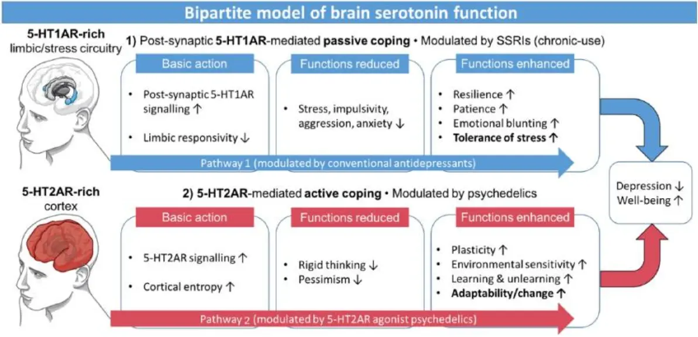

# Psychoactive Drugs


Nora D. Volkow, MD, is Director of the National Institute on Drug Abuse (NIDA) at the National Institutes of Health

https://www.youtube.com/watch?v=v1zVAOdzynk&t=2383s

From 39:45

Tim Ferriss: there's so many incidental or accidental ways
to ingest, for example, fentanyl.  And I know of many direct stories,
where people have gone to a bachelor  party, they try a little bit of some drug,   that ends up being cut with fentanyl. I know of  two people specifically. One just dropped dead on
the floor. One fell into a coma from what would've  been considered low doses of illicit drugs. But
they happened to be cut with fentanyl, which is  horrifying. And in fact, my friend who died was
not himself an addict. He was collateral damage. One of my other friends I grew up with,
there are a lot of drug issues where I grew up,  was a heroin addict. He had developed just an
incredible tolerance to fentanyl, and he gave it  to my other friend to help with his hangover. And
my other friend had never used any opiates, and he  fell asleep and just never woke up. So the sheer
ease with which the fentanyl, as you mentioned,  sort of permeates different corners and
neighborhoods of society, which does not  discriminate in terms of — or I shouldn't say
it doesn't discriminate, but it has infiltrated  every socioeconomic class. It's really pervasive
and really terrifying. What is your perspective  on the War on Drugs and perhaps any other
approaches that you think may be more effective?

Dr. Nora Volkow: Yeah. And I'll answer it, but I guess actually the story that you just told  of your friend that how he'd be taking fentanyl
unbeknowing what it was, it just killed him. And  this is what we are observing a lot. And I think
it's important to educate people that this is  a seriously dangerous drugs. And unfortunately,
I think that we have cried wolf so many,  many times that we've lost credibility. 
But if there was a way that we could convey  that in very objective, we don't need to
exaggerate in any way. I mean fentanyl, two  milligrams will kill you. And the counterfeit
pills contain five milligrams, some of them two  doses to kill you. So it is very, very tragic. 
But coming back to your question in  terms of the War on Drugs, I think that
basically what it did was it created a mechanism  that could perpetuate structural racism. It is
very tragic to see how its enforcement led to  the incarceration of young black Americans. 
And again, that punitive system where someone  could be stopped, and this will happen if you are
black and on the notion that you had drugs with  you and thrown in jail or prison because you had
drugs on you is such an unfair system. And it  didn't work in any way because it did not reduce
the amount of drugs that people were taking or  the negative consequences of drugs to our society.
So it did not work. And I think, and too, I mean one   of the aspects that it did show is if you do  throw a person that's taking drugs in jail,
if you criminalize that person that's  using drugs, for example, when we did   horribly with crack cocaine. So if you  were smoking crack cocaine, it was like,
I don't recall exactly, but it was at least 10  times greater than if you were just snorting
cocaine. Snorting cocaine or injecting cocaine  hydrochloride was much more favored by white
people. Whereas crack was favored by black people. So cocaine hydrochloride, white, crack cocaine,
black. Why do you see such a difference? It's  the same cocaine, basically. Cocaine is cocaine,
and yet one could note a much higher penalty than  the other. That's an example of the consequences. 
But what science has shown is that when you do  throw people into jail or prisons that have a
problem with substance use disorders, then when  they leave, they are at much greater risk of,
first of all, relapsing immediately into the  drug taking and escalating their drug taking.
So you are exacerbating the nature of the  problem by putting them in jail and prison.  So it doesn't work no matter what you do. And  that's why the whole notion of criminalizing
the person that takes drugs is basically very  negative vis-a-vis the outcomes of the person
and also in no way it benefits society,  it is actually very costly by itself.
When an issue becomes politicized, then it  becomes much harder to change and shift. 
And we've seen, I think, that we've  seen over the past, I would say,
certainly, five or eight years, an openness to  recognizing that the War on Drugs did not work
and that criminalizing drug users is basically  negative and it's promoting structural racism. 




Nutt, D. J., King, L. A., & Phillips, L. D. (2010). Drug harms in the UK: a multicriteria decision analysis. *The Lancet, 376*(9752), 1558-1565.



Also check out:
- [Decriminalize Our Minds](https://www.decriminalizeourminds.org/)
- Parody [Drug Dealers Against Legalization](https://jpritikin.github.io/ddal/)
- [A sane reform proposal](https://maps.org/bulletin-criminal-legal-system-reform-healthier-society/)
- [Limitless 2011](https://en.wikipedia.org/wiki/Limitless_(film))

## My experience

Psychedelics are substances that reveal and amplify your inner experience.[^nichols2023]

<table>
<tr>
<td>
<picture style="display: block;">

</picture>
</td>
<td class='rotate'>
Credit: Midjourney "sacred mandala"
</td>
</tr/>
</table>

I have personal experience with

*   Psilocybin 🍄
*   Salvia divinorum
*   Cannabis
*   Daime (a.k.a. ayahuasca) 🍵
*   Piper methysticum (kava kava)
*   Sceletium tortuosum (kanna)
*   Psilomethoxin ([orally active 5-methoxy-N,N-dimethyltryptamine](https://www.youtube.com/watch?v=SeROOGFnwek)) 🐸

I am a member of
- [Santo Daime](https://en.wikipedia.org/wiki/Santo_Daime)[^catholic] (link to [hymns](http://daimebooks.org))  
  
  
Me with [Padrinho Jonathan Goldman](https://casetext.com/case/church-of-holy-light-of-queen-v-mukasey-2)  

- [Church of Sacred Synthesis](https://psilomethoxin.com/?sld=jpritikin)
- [Sacred Garden Church](https://sacredgarden.life/)


Psychedelics are not for everybody.


## Amplification

The subjective sense of psychedelic amplification is the reflection of
a corresponding impairment of working memory.[^healy2021]
However, working memory is not monolithic.
Different psychedelics impair different aspects
of working memory.
[Salvinorin A]() impairs cognitive working memory
much more than emotional working memory.
Serotonergic psychedelics impair emotional working memory
much more than cognitive working memory.

### Predicting Your Reaction to Psychedelics

Your reaction to a psychedelic strongly depends on the willingness of your Parts to get quiet.[^aday2021]
See my discussion of [effortless meditation]() to learn more about Parts
and how to help them relax. There are at least three possible outcomes:
- Parts are overactive and not willing to get quiet. A psychedelic will tend to make Parts more loud and extreme. This is going to be a difficult trip and corresponds to the monkey mind of an inexperienced meditator 🐒, magnified to Godzilla size.
- Parts are active but willing to get quiet. In this situation, the client gains more access to Self energy and may do Parts work spontaneously. There is the opportunity to make rapid strides toward therapeutic goals.[^ifs-mdma]
- Parts are fairly quiet. The Self shines with unusual brilliance 🌞 because the psychedelic does the bouncer Part’s job, facilitating an experience of Self that is profoundly effortless. Similar to effortless meditation, there is ample capacity for blending with a target. This is readily seen in reports of music perception under the influence of psychedelics. For example, “Volunteers reported far greater absorption in music, as well as greater perceived beauty and significance of music.”[^barrett2018]

Suppose you are curious to try a psychedelic but are not sure whether your Parts will get quiet.

Which psychedelic poses the least risk to the naive user?


### Serotonin

Some of the most popular psychoactive substances operate by modulating the serotonin system.
Serotonin is important because it is, in part, responsible for the regulation of serenity.[^olivier1990]
Serotonin is also known as 5-hydroxytryptamine, or abbreviated, 5-HT.
There are at least 14 different serotonin receptors that allow cells
to respond in various ways to the presence of serotonin. The two most prevalent brain receptors
are known as 1A and 2A (also called 5-HT1A and 5-HT2A).
The figure below shows the function of the two main serotonin receptors.[^serotonin2017]

{.center}

Credit: Carhart-Harris & Nutt, 2017, Figure 3
{.center}

I suggest that psychedelics that target the 5-HT1A receptor pose the
least risk to the naive user.
The subjective experience is a gentle spotlight on the feeling of soothing comfort.
Using this soothing comfort as a target helps tangled Parts relax.
Until recently, MDMA and 5-MeO-DMT were the popular psychedelics
that seemed to modulate 5-HT1A activity.
5-MeO-DMT directly modulates the 5-HT1A receptor, but MDMA influences it indirectly.
MDMA seems to influence the 5-HT1A receptor by
its ability to release serotonin (biology is complicated[^ray2010]).
In any case, both MDMA and 5-MeO-DMT have disadvantages compared to
[psilomethoxin]().
The disadvantage of 5-MeO-DMT is its rapid onset and come down, which can be disorienting.
In contrast, psilomethoxin has a user-friendly gradual onset and come down.
However, the main advantage of psilomethoxin over these other
substances is its legal status.
Psilomethoxin is currently unregulated and easy to obtain.

Once there is familiarity with altered states and some confidence is
gained in [effortless meditation]() then
I suggest the next psychedelic to try is dimethyltryptamine (DMT),
a potent 5-HT2A agonist,
combined with a monoamine oxidase inhibitor,
a combination colloquially known as Daime or Ayahuasca.
Pure vaporized DMT has an extremely rapid onset and come down.
The monoamine oxidase inhibitor stretches out the journey to about four hours,
with a gradual onset and come down.
Subjectively, in contrast to psilomethoxin, DMT does not spotlight any particular emotion
but facilitates affective unblending in a more pure or indifferent way,
demanding more cooperation from Parts to guide the experience.

Unaided, [effortless meditation]() is precarious in the sense that we can not entertain targets that prompt much Part involvement.
This is where DMT can pick up the slack.
DMT can facilitate Self energy in situations where Parts must exert some effort. For example, Santo Daime is a psychedelic church that has won legal protection in the USA, parts of Canada, and Brazil. In Santo Daime ceremonies, everybody present drinks Daime tea, lead musicians included. Moreover, everybody is expected to sing 🎶 and dance. It seems unlikely to me that new members would often enjoy much Self energy without the help of the psychedelic sacrament. The Daime helps the congregation remain mostly in Self while exerting considerable effort to pronounce Portuguese and precisely synchronize movements to the rhythm 🥁 of the music. The combination of ample Self energy and creative involvement in the ceremony can make for an extraordinarily beautiful experience.

## Notes

[^catholic]: I am a bit embarrassed to be affiliated with Catholicism given its [sordid history](https://en.wikipedia.org/wiki/Catholic_Church). In general, I admire the best of all of the world's religions.

[^serotonin2017]: Carhart-Harris, R. L., & Nutt, D. J. (2017). Serotonin and brain function: a tale of two receptors. *Journal of psychopharmacology (Oxford, England), 31*(9), 1091-1120.

[^olivier1990]: Olivier, B., & Mos, J. (1990). Serenics, serotonin and aggression. *Progress in clinical and biological research, 361*, 203-230.

[^ifs-mdma]: [MDMA and PTSD STUDIES](https://ifs-institute.com/resources/research/mdma-and-ptsd-studies)

[^barrett2018]: Barrett, F. S., Preller, K. H., & Kaelen, M. (2018). *Psychedelics and music: Neuroscience and therapeutic implications. International Review of Psychiatry, 30*(4), 350-362.

[^ray2010]: Ray, T. S. (2010). *Psychedelics and the human receptorome. PloS One, 5*(2), e9019.

[^aday2021]: Aday, J. S., Davis, A. K., Mitzkovitz, C. M., Bloesch, E. K., & Davoli, C. C. (2021). Predicting reactions to psychedelic drugs: A systematic review of states and traits related to acute drug effects. *ACS Pharmacology & Translational Science, 4*(2), 424-435.

[^nichols2023]: Nichols, D. E., Nichols, C. D., & Hendricks, P. S. (2022). Proposed Consensus Statement on Defining Psychedelic Drugs. *Psychedelic Medicine.* https://doi.org/10.1089/psymed.2022.0008

[^healy2021]: Healy, C. J. (2021). The acute effects of classic psychedelics on memory in humans. *Psychopharmacology, 238*, 639-653.
