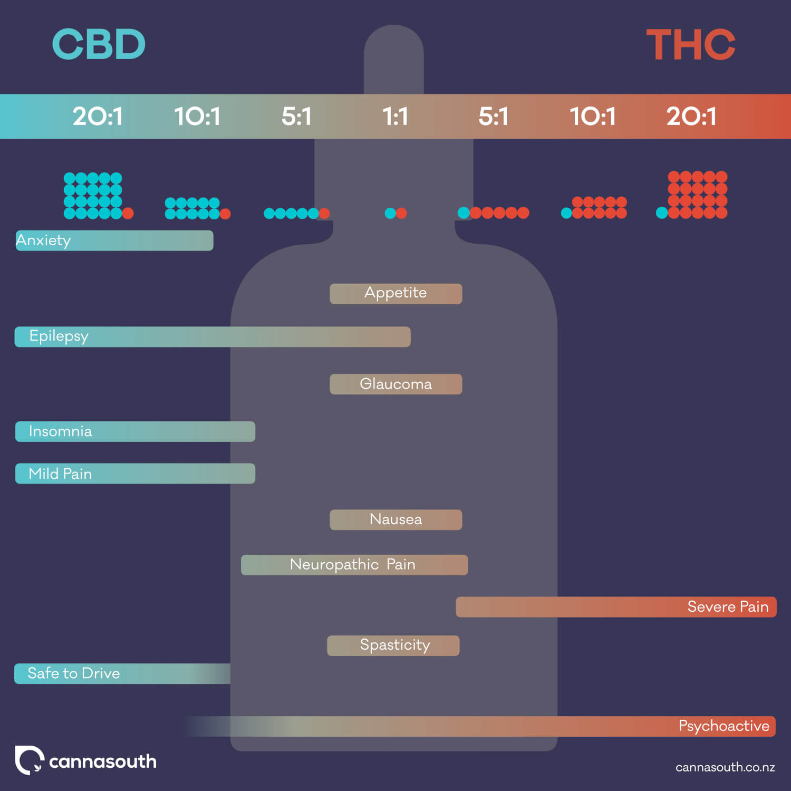

# Cannabis

## Introduction

[Cannabinoids](https://en.wikipedia.org/wiki/Cannabinoid), a fascinating family of substances found in cannabis, remain shrouded in mystery despite their growing popularity. While over 100 cannabinoids have been identified, our understanding of these compounds is surprisingly limited. The scarcity of peer-reviewed research has left a significant gap in scientific knowledge, with many individual cannabinoids yet to be fully characterized and potential synergistic effects largely unexplored.[^entourage]

In light of this knowledge deficit, personal exploration becomes a valuable, albeit limited, source of insight. Here I present my evolving ideas about cannabinoids, primarily based on self-experimentation and a critical analysis of available scientific literature, anecdotal reports, and expert opinions. By combining these sources, I aim to contribute to a more comprehensive understanding of cannabinoids while acknowledging the shortcomings of this approach.

## Background

{}

{.center}
<--->

{.center}
{}

Medicinal use of cannabis dates back at least 5,000 years.
Delta-9 tetrahydrocannabinol (THC) is the primary psychoactive in cannabis.
Commonly reported effects of THC include relaxation, euphoria, increased appetite, pain reduction, drowsiness, and occasionally, anxiety.
Cannabidiol (CBD) is another widely known cannabinoid.
It is widely studied for its potential therapeutic benefits, including anti-inflammatory and anxiolytic properties.

### Terpenes

Terpenes are aromatic compounds that give different cannabis strains their unique scents and flavors. Found in many plants, cannabis contains over 100 different terpenes. These compounds may work synergistically with cannabinoids in what's called the *entourage effect*. Common terpenes include myrcene, limonene, and pinene.

I know nothing about terpenes.

### Fellow Travelers

[Cannabinoids with Turkey](https://www.cannabinoidswithturkey.com/) 🦃 -- This guy has an ahead start of 10 year on me. Page numbers given below reference:
- Turkey. (2024). *The Classical Cannabinoid Consumers Guide (2024 Edition): Everything you need to know about cannabinoids in terms you can understand.* Independently published.
    
### Social Sommelier Terpene Tastemaker

My approach to cannabis differs starkly from businesses like Philip Wolf's Cultivating Spirits. They focus on traditional cannabis cultivation and whole plant properties. These businesses highlight the sensory experience of different strains. Their model centers on shared experiences and cannabis culture. They often pair strains with foods and wine. They prefer smoking or vaping for quick effects and aroma. These approaches celebrate the plant's natural traits instead of isolating compounds. They create experiences based on traditional growing methods and the natural mix of cannabinoids and terpenes.

## Routes of administration

Inhalation is probably the most widely known route of administration because it is so conspicuous.

- Inhalation (Smoking or Vaporizing): 
  - Pros: Rapid onset of effects (usually within minutes)
  - **Cons**: Respiratory irritation (especially with smoking), short duration of effects, imprecise dosing, must avoid acetate forms[^acetates]
- **Oral Ingestion** (Edibles, Oils, Capsules):
  - **Pros**: Longer-lasting effects (4-8 hours typically), no respiratory risks, discreet consumption, precise dosing
  - Cons: Slow onset (30 minutes to 2 hours)
- Sublingual (Tinctures, Sprays):
  - Pros: Relatively fast onset (15-45 minutes), bypasses first-pass liver metabolism
  - **Cons**: Hard to segregate from oral ingestion
- Topical (Creams, Balms) or Transdermal (Patches): This is **not comparable** because the effect is localized and non-intoxicating.

### Why prefer a longer duration?

The extended duration aligns well with those seeking a more profound, intimate experience, allowing for deeper introspection or prolonged relaxation.
This lengthier effect discourages casual or frequent use, potentially promoting a more mindful and respectful relationship with the substance.
However, the delayed onset of ingested cannabis makes accurate dosing crucial, as miscalculations can lead to uncomfortable experiences lasting several hours.
Users must carefully consider their dose and timing, as the extended duration can become problematic if unexpected obligations arise.

## The THC:CBD Ratio

THC is often taken in concert with CBD.
But the intensity of the experience is mostly a function of the amount of THC.
I'm not sure exactly how much CBD is required to complement the THC.
You definitely want enough CBD and extra isn't a problem.
Unless you are already an expert user:

{}
Do not take THC without CBD.
The combination of THC and CBD feels completely different than either molecule ingested alone.[^klein2011]
{}

I am skeptical about the following infographic, but I tentatively agree that a ratio of 1:1 is a good place to start.
The same ratio applies for both Δ8-THC and Δ9-THC.

{}
The combination of THC and CBD is obsolete. [Check out my favorite blends.](#favorites)
{}

## New cannabinoids

Cannabis plants were traditionally categorized into two main types: sativa and indica, each known for distinct effects:

- Sativa
  - Energizing, uplifting effects
  - Often described as producing a "head high"
  - Believed to enhance creativity and focus
- Indica
  - Relaxing, sedating effects
  - Often described as producing a "body high"
  - Believed to aid sleep and reduce anxiety

However, the botanical validity of this simple dichotomy has been eroded by two significant trends:

- Decades of selective breeding have resulted in a diverse array of cannabis varieties, each with unique characteristics. Connoisseurs now recognize and appreciate a much wider spectrum of cannabis experiences beyond the traditional sativa-indica divide.
- Creative chemists have worked to isolate and synthesize individual cannabinoids. This has expanded the catalog of available substances, moving beyond what can be produced solely through plant cultivation.

As a result, the cannabis landscape has shifted.
The insatiable demand for novel cannabinoid blends no longer relies exclusively on careful plant cultivation.
Instead, isolated cannabinoids can be mixed in precise proportions to produce desired effects, offering a level of customization previously unattainable through traditional growing methods.
Since 1986, cannabinoids were hindered by legal ambiguity.[^rubin2023]
After the 2018 Farm Bill, many interesting cannabinoids became legal.[^oregon-hb3000]

Cannabinoids can be organized into two categories: THC-like and CBD-like.
In general, the experience of one or more THC-like substances are improved by pairing with one or more CBD-like substances. However, some single cannabinoids are great in isolation.

### Euphoriants (THC-like buzz)

- THC (Δ8-THC or Δ9-THC) offers a malleable high. THC stays in the background. Its phenomenology is largely shaped by potentiators. Trip time is about 6-7 hours from ingestion. Δ9 is a touch more beautiful than Δ8, but they are both marvelous. 💡
- Δ10-THC (actually 70% Δ10-THC, 22% Δ8-THC) offers a serene head high. The phenomenology is less shaped by potentiators than THC. Δ10-THC itself takes center stage. Compatible: CBN, THCV, CBT, CBC. CDBV is not bad, but I prefer the softness of CBC/CBT. Incompatible: CBD, H4CBD. Trip time is about 8-9 hours from ingestion.  For occasional use, tolerance half-life seems to be about 36 hours.
- HHC (hexahydrocannabinol) feels similar to Δ8-THC, but distributed unevenly across the body. Most of the effect is from the neck up, with some sensation from the waist up. The high is roughly balanced between energizing and relaxing. Weird.[^turkey-hhc] 👎

My tentative take is that there are not that many real choices for euphoriants.
There are substances with different potency and duration, but most of the variety in subjective effect is obtained through pairing with potentiators.

#### Closest Cousins: Δ8-THC vs Δ9-THC

{}

{.center}
<--->

{.center}
{}

If you haven't tried THC, start with Δ8-THC before trying Δ9-THC.

For occasional use, tolerance half-life seems to be about two days.
There is likely cross-tolerance because both substances are [CB1](https://en.wikipedia.org/wiki/Cannabinoid_receptor_1) agonists.

### Potentiators (CBD-like)

- CBD is the classic potentiator. CBD opens the emotional spigot around the heart.
- [H4CBD](https://en.wikipedia.org/wiki/H4-CBD) (hydrogenated CBD) offers the reassurance of CBD, but in an even more delightfully exquisite way. More cognitive and longer duration than CBD. H4CBD is not only stronger than CBD; it has a different character. H4CBD is serious, not blissful. H4CBD is a powerful antiemetic.
- **CBN (cannabinol) offers a head high without narrowing focus. This is the most underrated cannabinoid.** 🤙🏼  
Consider a cup of coffee in the morning. The first few sips often bring the most pleasure--the warmth, the aroma, the initial burst of flavor. By tuning into these sensations, we might find that a single well-brewed cup brings more satisfaction than drinking several cups mindlessly. The same principle applies to many pleasures in life. This approach isn't about deprivation--it's about discovering that *enough* often contains more joy than excess. When we eat until we're comfortably satisfied rather than stuffed, we feel energized rather than lethargic. The Japanese concept of *hari hachi bu*--eating until you're 80% full--captures this wisdom. It's not about rigid restriction, but rather finding that sweet spot where satisfaction lives. This principle extends beyond food to many areas of life--entertainment, shopping, work, even social media consumption. In the cannabis world of euphoria and bliss, arguable the most important dimension is finding contentment in sufficiency. That is one of the virtues of cannabinol. Cannabinol bolsters our innate wisdom to be satisfied.
- CBG (cannabigerol) taken alone, I don't notice any effect from it. With THC activation, CBG narrows focus. This results in a scatterbrain feeling where it takes more effort to hold onto a single coherent train of thought. It also stokes impatience. Why do people enjoy this? It's cognitively fucked up. It might be okay at moderate dosage if you have a well-defined project to latch onto, but otherwise I'll pass. **Overrated.** 👎🏼
- THCV (tetrahydrocannabivarin) simulating head high. Just a touch of scatterbrain. More alert than CBG. Maybe too alert. Harsh alertness? (Despite starting with the letter T, this is a potentiator because it doesn't do much without a euphoriant.)
- CBC (cannabichromene) holds the heart steady in a courageous propeller shape. The propeller blades are about two inches in diameter and centered near the sternum. The stationary propeller blades extend left and right. The blades start spinning above some threshold of THC activation. Beautiful, but not better than CBDV or CBT.[^turkey-cbc]
- CBT (cannabicitran) holds the heart steady in a hollow, receptive shape while allowing a head high. Possibly more potentiating and gentler come-down than CBDV.[^turkey-cbt]
- CBDV (cannabidivarin) holds the heart steady in a neutral shape while allowing a head high. A bit stimulating, but not incompatible with relaxation.

#### Two-way Interactions

| X | Y | Comments |
| -- | -- | ------------------------ |
| CBD | CBDV | Clashes: CBD is not relaxing enough. And CBDV is not steady. 👎🏼 |
| CBN | CBD | See [details here](). |
| CBN | CBG | Both put you in headspace (but CBN more so than CBG). CBG narrows focus, CBN doesn't. The ratio lets you pick how much you want to narrow your focus. 🤔 |
| H4CBD | CBC | Marvelous combo. The seriousness of H4CBD is balanced by the levity of CBC. CBT offers levity too, but are both yin. The yang of CBC is a better complement to the yin of H4CBD. |

#### Munchies

The *munchies* refer to a sharp increase in appetite that can make food seem irresistibly delicious. CBD causes this food-craving phenomenon. For H4CBD, the effect is most pronounced during the comedown period, when its effects resemble those of standard CBD. For the appetite-stimulating effect to occur, CBD must comprise more than 50% of a given blend's total CBD-like potentiators. For example, a blend containing Δ8-THC, CBD, and CBN in a 4:1:1 ratio does not increase appetite because the CBD concentration is too low (only 50%).

Some users report an appetite-suppressing effect with certain cannabis blends. Is this for real? I think blends are either appetite-neutral or cause food cravings. None of the blends I've tried noticeably suppress appetite.

## Blends

### Energizing Relaxing Combo?

{}
{}
Energy dominates.

- Δ10-THC dominates Δ8-THC.
- CBDV dominates CBD.

Also, tolerance can be different for different components of a blend. So energy blends can feel especially weird if you don't wait long enough for the tolerance to wear off.
{}
{}

### Favorites

| Cannabinoids, ratio | Description, comments |
| ----------------- | ------------------------ |
| ΔX-THC:CBN:CBD Y:1:1 | Mildly psychoactive, mostly just ordinary relaxation. **Underwelming in a good way.** [See details.]() 🤙🏼 |
| Δ8-THC:CBN:CBx 6:2:1 | **Super Fucking High** ♥️ CBx is one of CBC, CBDV, CBT. 🚀 Reference dose is 25mg Δ8-THC. |
| Δ8-THC:CBN:H4CBD:CBC 10:3:1:1 | **Brahman** ♥️ Perfect complement to Daime. Reference dose is 50mg Δ8-THC, but I'd only use about half that when pairing with Daime. 🤙🏼 |
| CBN-P:CBN-O 4mg:40mg | Can be used **daily** for sleep. 😴 🌛 [See details.]() 🤙🏼 |
| Δ10-THC:CBN:CBx 7:1:1 | **Superhuman focus** work blend. CBx is CBC or CBT. CBC is confidently blissful (yang). CBT is smooth and receptive (yin). Reference dose is 67mg Δ10-THC. 🤙🏼 |

My reference dose is strong. To judge these blends, I gotta feel 'em vividly. You might start with 1/2 or 1/4 of my reference dose.

### Recipe Logic

Here's how I think about designing recipes. This recipe is intermediate between THC:CBN:H4CBD:CBC and THC:CBN:CBx.

<svg viewBox="0 0 400 360" xmlns="http://www.w3.org/2000/svg">
  

  <rect width="400" height="360" fill="white" />
  
  <!-- Controls -->
  <g class="controls-group" transform="translate(250, 60)">
    <text x="0" y="15">Δ9:</text>
    <g class="switch" transform="translate(25, 3)">
      <rect class="switch-track" width="40" height="16" />
      <circle class="switch-thumb" cx="10" cy="8" />
    </g>
  </g>

  <!-- Back button -->
  <g class="back-button-group" transform="translate(20, 310)" style="display: none;">
    <rect class="back-button" x="0" y="0" width="80" height="30" rx="5" ry="5" />
    <text class="back-text" x="40" y="19">← Back</text>
  </g>
  
  <!-- Main Pie Chart -->
  <g id="main-pie" transform="translate(150, 180)">
    <!-- Pie slices will be generated by JavaScript -->
  </g>
  
  <!-- Legend -->
  <g id="legend" transform="translate(240, 280)">
    <!-- Legend items will be generated by JavaScript -->
  </g>

  
</svg>

### Experimentation

#### Log

| Cannabinoids, ratio | Description, comments |
| ----------------- | ------------------------ |
| Δ8-THC:CBD 2:1 | Clashes with daime. Do not recommend. 👎🏼 |
| Δ8-THC:H4CBD 2:1 | Holy mole! **Very beautiful** ♥️ But H4CBD lasts too long. It's a rough come-down. It probably would be better with Δ9-THC because the durations would match better? Meh, needs CBN. |
| Δ8-THC:H4CBD:CBC 46:46:8 | CBC seems to clash with H4CBD. 👎🏼 |
| Δ8-THC:Δ10-THC:H4CBD 1:1:2 | Δ10-THC seems to dominate Δ8-THC. H4CBD feels like CBD. 👎🏼 |
| Δ10-THC:CBG 1:1 | Super clear-headed stimulating head-high. Just a touch scatterbrained. 🤙🏼 |
| Δ8-THC:H4CBD 1:2 | Less spacious compared to 1:1 ratio. Sleepy. Feels fairly sober when walking around, but easy to get absorbed in meditation. Extreme muchies. 🤔 |
| Δ8-THC:CBN-O 38:62 | Beautiful relaxing, sparkling head-high. Not conducive to sleep. A bit prone to anxiety. 🤔 |
| HHC:CBN-O 1:2 | Not as relaxing, light, and sparkly as Δ8-THC:CBN-O. Not a headache, but some tension in the head and chest. Not great for sleep. 👎🏼 |
| Δ10-THC:CBN 1:1 | Not as shit as HHC:CBN-O, but nothing special. 🤔 |
| Δ8-THC:CBN-O 25:30 | Beautiful relaxing head-high. Works even if CBN was used on the prior evening. CBN is sensitive to time-of-day effects (night good, day bad). 🤔 |
| Δ8-THC:H4CBD 1:1 | Beautiful meditative experience. However, there is a duration mismatch as the H4CBD lasts too long. 🤔 |
| Δ8-THC:CBT:CBN-O 25:16.6:5 | Very beautiful. Probably would be better with ratio tilted toward CBN. 🤔 |
| Δ8-THC:THCV:CBDV 4:1:1 | Clear simulating head high. Alert, but not superhuman focus. 🤙🏼 |
| Δ8-THC:CBN-O:CBC 25:16.6:8 | Pretty great! 🤙🏼 |
| Δ10-THC:THCV:CBDV 4:1:1 | Not unpleasant. Pretty functional. Too low dose (33mg Δ10-THC) to make a confident judgment. Not clear how THCV contributes. 🤔 |
| Δ10-THC:CBG:CBT 46:46:8 | CBG feels functional. CBT was a great choice, clearly evident. Dose was 50mg Δ10-THC, strong but okay for working. Just a touch scatterbrained. 🤙🏼 |
| Δ10-THC:CBG:CBC 50:25:8 | Less CBG feels less scatterbrained? Interesting! CBC is not unpleasant but too relaxing. CBC makes me want to lie down and stop working. CBT was better. Hey wait! Maybe what went wrong here was the head-heart balance. Now I want to re-test CBC. 🤔 |
| Δ10-THC:CBG:CBT 50:12:8 | Less scatterbrained, but ultimately not enough CBG to stay focused. Gets too blissful and chill after 4-5 hours. |
| Δ8-THC:CBN-O:H4CBD 62.5:16:12.5 | Tug toward meditation, in stark contrast with CBD's more somatic relaxation. CBN-O:H4CBD ratio could probably be tipped more toward CBN-O, like CBN-O:H4CBD 2:1. 🤙🏼 |
| Δ8-THC:CBN:CBD:CBDV 62:31:25:6 | CBD is not relaxing enough. And CBDV is not steady. CBD munchies can sneak through? Meh 🤔 |
| Δ8-THC:CBN:CBD 4:(1-ζ):ζ for 0<ζ<1 and ζ≠0.5 | For ζ<0.5 (more CBN), CBD's relaxation is inadequate. You obtain a high with restlessness. For ζ>0.5 (more CBD), you risk overindulging in CBD. If you want to do that, skip the CBN and use CBD only. If you can't measure precisely, I guess more CBD is better than more CBN. ζ=0.5 is so much better, maybe the best way to enjoy CBD. 👎🏼 |
| Δ10-THC:CBN-O:CBG:CBT 50:20:12:8 | CBN affects the head-heart balance, but otherwise doesn't contribute much. The head-heart ratio of 32:8 was a bit too tipped toward head (80%). A little more bliss would be nice. CBG narrowed focus, but not too scatterbrained. 🤙🏼 |
| Δ10-THC:CBN-O:CBG:CBC 50:15:9:8 | Very beautiful. This seems pretty close to optimal. 🤙🏼 |
| Δ10-THC:CBN-O:CBG:CBT 50:10:9:8 | Better energy-bliss balance with this ratio. Seems mostly faded after only 4 hours from ingestion--maybe because it's such a smooth landing? Sensational. 🤙🏼 |
| Δ8-THC:CBN:CBD 4:1:1 | Clashes with daime. Do not recommend. 👎🏼 |
| Δ8-THC:CBN-O:CBD 40:10:10 | Feels like CBN and CBN-O are interchangable in combination with THC. Interesting. Gotta test another recipe too. 🤔 |
| Δ10-THC:CBN:CBD:CBG:CBT 50:10:9:8 | Here too, it feels like CBN and CBN-O are interchangable in combination with THC. 🤔 It seemed a bit too blissful. Maybe try 15mg CBN again. |
| Δ8-THC:CBN:H4CBD:CBT 12:3:2:1 | Beautiful complement to daime! Seems to reduces nausea! I suspect CBT not a good idea. 🤔 |
| Δ10-THC:CBN:CBC 50:15:5 | Seems better without CBG brain funk. Not sure about optimal CBN:CBx ratio. Need more trials. |
| Δ8-THC:CBN:H4CBD 6:2:1 | Ick. H4CBD dominates and casts a shadow over CBN. The CBN fizz is the bad kind that prompts anxiety. 👎🏼 |
| Δ8-THC:CBN:H4CBD:CBC 10:3:1:1 | This one is the cat's meow. CBC is the perfect complement to H4CBD. CBN ratio feels great. Dose was 50mg THC. Cognition mostly unaffected; it's almost functional. Not sure what else to ask for. Nailed it. 🤙🏼 |
| Δ8-THC:CBN:H4CBD:CBC 10:3:1:1 | Tried 30mg THC w/ Daime. It was pretty great, but maybe the dose could be a little higher, like 35mg. |
| Δ10-THC:CBN:CBT 67:10:9 | This ratio feels even better. Bliss is there, but not excessive. CBx:TOTAL 19/86=22%. 🤙🏼 |
| Δ8-THC:CBN:H4CBD:CBC 10:3:1:1 | Tried 35mg THC w/ Daime. It was plenty strong. I'm concerned that it blocks too much sensitivity. Defintely wouldn't increase the dose. This is the ceiling. |
| Δ10-THC:CBN:CBD:CBG:CBT 50:6.6:6.6:6.6 | Try to salvage my blend with CBG. At this ratio, the CBG isn't too heavy. I might even like it. CBx:TOTAL 2/7 = 28%. 🤙🏼 |

#### Agenda

| Cannabinoids, ratio | Description, comments |
| ----------------- | ------------------------ |
| Δ10-THC:CBN:CBC 50:10:10 | Trial different CBN:CBC ratio |
| Δ10-THC:CBN:CBC:CBT 50:15:4:4 | Both CBC and CBT? |
| Δ10-THC:CBN:CBD 50:12:12 | Who knows? It might be awesome. |
| Δ8-THC:CBN with both CBC and CBT? | How do they interact? |
| Δ10-THC:THCV:x ? | TBD |

## Storage

Acetylated cannabinoids are particularly vulnerable to thermal degradation.
Store them in the refridgerator.
Other cannabinoids will probably be happier in the refridgerator too.[^clarke1998]

## Hepatotoxicity

- CBD: Less than 300 mg/day is safe.[^lo2023]

## Notes

[^entourage]: https://en.wikipedia.org/wiki/Entourage_effect

[^acetates]: Munger, K. R., Jensen, R. P., & Strongin, R. M. (2022). Vaping cannabinoid acetates leads to ketene formation. *Chemical Research in Toxicology, 35*(7), 1202-1205.

[^lo2023]: Lo, L. A., Christiansen, A., Eadie, L., Strickland, J. C., Kim, D. D., Boivin, M., ... & MacCallum, C. A. (2023). Cannabidiol‐associated hepatotoxicity: A systematic review and meta‐analysis. *Journal of Internal Medicine, 293*(6), 724-752.

[^klein2011]: Klein, C., Karanges, E., Spiro, A., Wong, A., Spencer, J., Huynh, T., ... & McGregor, I. S. (2011). Cannabidiol potentiates Δ9-tetrahydrocannabinol (THC) behavioural effects and alters THC pharmacokinetics during acute and chronic treatment in adolescent rats. *Psychopharmacology, 218,* 443-457.

[^rubin2023]: Rubin, J. S. (2023). *Bizarro: The surreal sage of America's secret war on synthetic drugs and the Florida kingpins it captured.* University of California Press.

[^turkey-hhc]: Turkey wrote, "HHC is considered by many to be the closest alt cannabinoid we have to traditional D9 THC" (p. 104). 🤦

[^turkey-cbc]: Turkey wrote, "CBC is currently my favorite cnoid" (p. 195). 🤦

[^turkey-cbt]: Turkey wrote, "CBT feels like CBC's more weird and wild cousin. Same potentiating effects but with a much less calm and focused feeling" (p. 223). I agree that CBT is CBC's cousin. But much less calm and focused feeling? I don't notice that. 🤔

[^oregon-hb3000]: Since 2021, Oregon prohibits the **sale** of artificially derived cannabinoids. There is no prohibition against possession. You can verify this by visiting [Chapter 845](https://secure.sos.state.or.us/oard/displayDivisionRules.action?selectedDivision=6492) and searching for "penalty."

[^clarke1998]: See Clarke (1998, p. 86ff).
    - Clarke, R. C. (1998). *Hashish!* Red Eye Press, Inc.
