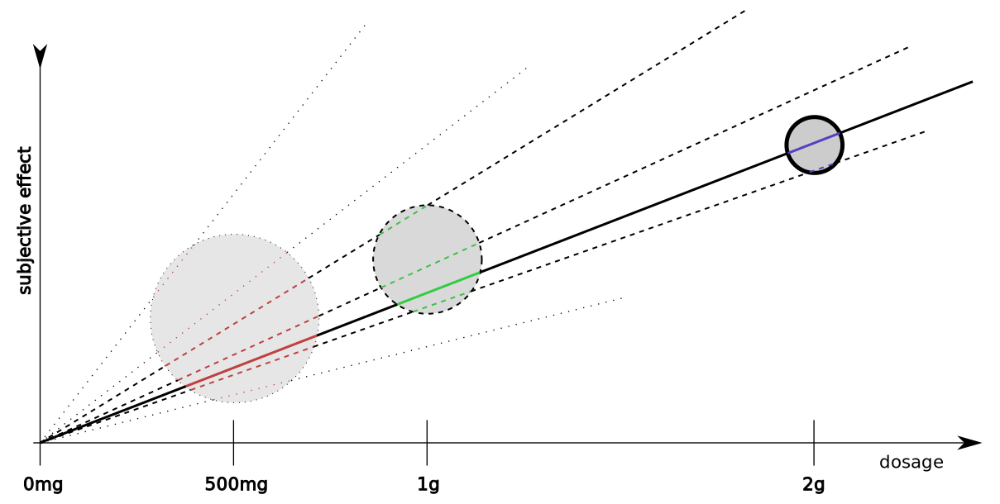

# Psilomethoxin

## Introduction

Psilomethoxin (Pm) offers a subjective experience similar to MDMA, but without MDMA’s stimulant-like effects. Pm is the ideal complement to psychotherapy.[^beres2019]

For more information, read [my case report]().

## Safety

According to the [2024 Mar 07 defamation lawsuit](https://drive.google.com/file/d/1l4Xjv15zfbKtf3WO0SXprOlZU7bHISK2/view?usp=drive_link):

> 96. Between November 2021 and August 2022, the Church Co-Founders shared the sacrament with approximately 750 people, most of whom were either veterans, cancer patients, and/or highly experienced entheogen-based religious practitioners. All the Sacrament dispensed during this time was done in a religious setting and great care was taken to ensure the Sacrament was respected and used appropriately at all times.
> 97. During the period described in the above paragraph, approximately 10,000 doses of the Sacrament were consumed without any negative reports or safety concerns raised; [...snip...]

> 105. In early April 2023, the Church sponsored an event in Austin, Texas called Entheogenesis. This event was aimed at bringing together the Church’s Texas membership and community but was attended by members and other entheogen-based religious practitioners from all over the United States and the world. In total, approximately 350 people attended the all-day event and Sacrament was offered multiple times throughout the day. Despite the number of people in attendance and amount of Sacrament consumed, there were no negative incidents, medical or otherwise [...snip...]
> 106. To date, at least 500,000 doses of the Church’s Psilomethoxin Sacrament have been dispensed without incident and as such, its safety profile is impeccable. In fact, based upon the actual numbers, it is very likely that most over the counter drugs have more dangerous side effects and cause more harm than the Church’s Psilomethoxin Sacrament.

### Contraindications

Since psilomethoxin is similar to 5-MeO-DMT, it is prudent to regard
contraindications for 5-MeO-DMT as contraindications for psilomethoxin
until we have more data.

- Allergy to Psilocybe mushrooms[^mushroom]
- Epilepsy (a strong contraindication for 5-MeO-DMT)
- 5-MeO-DMT interacts with CYP2D6 and monoamine oxidase (MAO) inhibitors.
  - CYP2D6 inhibitors such as Paroxetine, Bupropion, Quinidine, etc
  - MAO inhibitors such as beta carbolines, harmala alkaloids, moclobemide, etc
- Serotonin reuptake inhibitors
- Lithium
- Pregnancy or breastfeeding

For more details, see:
- [F.I.V.E.'s Risks and Cautions](https://five-meo.education/risks-and-cautions/)

Credit: Christopher Scott

## Suggestions for Initial Use

There can be a lot of anxiety associated with the first use of a substance.
The goal of this brief guide is to help you enjoy Pm, for the first time, with the least amount of risk.
- Since Pm blunts anxiety, try to avoid putting yourself in a situation that stokes anxiety.
- Be well rested. Sleepiness tends to clash with the pleasant effects of Pm.

### Storage

If you have dried Psilocybe mushroom powder, store it at room temperature in a dark place.
Storage in a refrigerator or freezer is not recommended because low temperatures can cause water to condense which can cause degradation.

### Cooking

Pm is sensitive to heat.
To mix the powder with chocolate, use the lowest possible temperature.
Even chocolate sourced from the Church of Sacred Synthesis has occasionally been found to be inert.

### Caution

Pm is generally manageable for individuals with [meditation]() experience.
However, those unfamiliar with introspective practices may find it challenging.
Lack of experience in self-reflection can result in uncomfortably vivid sensory experiences, such as heightened sensitivity to sound or touch.
This can occur mainly during the first hour.
There are some options to mitigate this risk:

- Coadminister with cannabis
- Vigorous physical activity (e.g., lift weights, hatha yoga, dance)
- [Hikrodose](#hikrodose)

### Dosage

Start with a low-to-medium [psycholytic](https://en.wikipedia.org/wiki/Psychedelic_therapy#Psycholytic_therapy) dose.
In this dose range, there is practically no visual or cognitive distortion.
The most obvious subjective effects are that you can no longer feel anxiety or boredom and a reduced interest in multitasking.

To make the discussion less cumbersome, refer to the following abbreviations:

| abbreviation | experience with Pm | experience with traditional psychedelics |
| ------------ | ------------------ | ------------------|
| naïve | no | no |
| trad savvy | no | yes |
| friend | no | - |
| pm savvy | yes | - |

A journey can benefit from a **pm savvy** guide because Pm is amenable to [emotional contagion and coherence]().
For this reason, a **pm savvy** guide should use the same or similar dose as the **friend** companion.
A sober trip sitter is of little benefit.
If a **pm savvy** guide is not available then a group of two or more **naïve** persons can work together to stabilize the emotional coherence.

| amount | remark |
| ------ | ------ |
| 150mg, 300mg  | Start here if you're **trad savvy** and alone with no companion. This is also a good place for a **naïve** person to start with a **pm savvy** guide. At 150mg, you may feel some energy circulation but probably not the true flavor of Pm. At the peak of 300mg, you will likely get a taste of Pm's true flavor. |
| 450mg  | A strong first journey is an option if there is a close relationship between the **naïve** friend and **pm savvy** guide. Regardless of your **friend**'s experience, at this dose, I recommend a **pm savvy** guide. |
| 600mg, 800mg  | A confident **pm savvy** guide could consider this dose for an adventurous **trad savvy** friend. For perspective, I would hesitate to use more than 600mg while driving a car. |

Amounts are in mg of dried Psilocybe mushroom powder.
Observe [caution](#caution) with doses above 250mg.

### Timing

Consume Pm at breakfast or lunchtime. The effects of Pm are best appreciated in the daytime because of the contrast to typical daytime mood. At night, there is already a natural tendency to feel somewhat similar to the effects of Pm, making the contrast less vivid.

### Food?

In contrast to alcohol, the effects of Pm seem mostly unaffected by recently eaten food.
If you take Pm in a capsule, chew the capsule before swallowing;
there have been reports of 1-2 hour delays possibly caused by consuming intact capsules on an empty stomach.
Taking a little food with Pm seems to speed absorption.
If you struggle with nausea then you may prefer to eat less food or use an antiemetic.[^nausea]
I suspect any nausea is mostly associated with anxiety. So you may feel more nausea during the initial journey but no nausea from larger doses, once you get comfortable with Pm.

### Administration

Once you decide on a dose, take the whole dose at once, or maybe within 5-10 minutes, if you want to try a tiny bit and then finish the rest.
Don't use Pm more than once per day;
to get familiar with the substance, you want to feel the subjective effects from the peak all the way through the afterglow and back to baseline.
The mild lingering afterglow can last for 3-12 hours.[^pharmacodynamics]

### Set & Setting

The subjective effects of Pm are not like coffee.
With coffee, you drink your first cup and immediately notice increased alertness, wakefulness, and improved cognitive performance.
In addition, you may notice enhanced mood and reduced anxiety, but with another cup or two you may notice a rebound in anxiety along with jitters, insomnia, and headaches.
In contrast, the effects of Pm can be surprisingly subtle.
[You may notice no difference and doubt whether Pm has any effect whatsoever.]()
You could take a higher dose for more dramatic effects, but it is safer to be as receptive as possible with a lower dose.

To sensitize yourself to the effects of Pm, select a boring environment.
You might go for a walk in the park during the first hour of the journey, but after that, you should sit down somewhere isolated.
Find an environment where you can test whether you can still feel boredom.
If you are a restless impatient person, this is actually an advantage because it will be easier to notice when you cannot feel boredom.

Suppose the subjective experience of Pm can be reduced to a slope (see above).
Pm is a psychoactive chameleon in the sense that its effects are strongly influenced by expectation and the user's state of mind.
If you bring the appropriate expectation, the experience can feel similar to nitrous oxide (laughing gas) or psilocybin.
To really understand the effect, it is important to sample Pm at different dosages.
This helps constrain the slope.
If you only try a dose of 500mg then there is a lot of uncertainty about what the subjective effects actual are (lightly dotted lines). If you try 500mg and 1g then that narrows down the subjective effects somewhat (dashed lines). If you try 500mg, 1g, and 2g then you can look for commonalities across your experiences to refine your understanding of the effect (thick line).

At the risk of creating expectancy bias, I suggest the subjective experience of Pm boils down to:
- enhanced emotional clarity
- blunting of anxiety
- reduced interest in multitasking
- increased patience

As another data point, according to the [2024 Mar 07 defamation lawsuit](https://drive.google.com/file/d/1l4Xjv15zfbKtf3WO0SXprOlZU7bHISK2/view?usp=drive_link):

> 85. On or about September 2021, the first batch of Sacred Psilomethoxin mushrooms were created. Within a few days of creating the first batch, approximately ten highly experienced entheogen-based religious practitioners sampled the new sacred mushrooms by engaging in a three day “dieta.” At the end of this sacred process, all agreed the effects of the new Sacraments were similar to what a 4-hydroxylated version of 5-MEO-DMT would produce and was similar to a very weak, orally available, longer-acting form of 5-MEO-DMT.

### Hikrodose

A group might plan a *hikrodose* that consists of consuming Pm and then hiking through nature together.[^hikrodose]
With a dose of 1g or less, you may not feel anything unusual during the hike.
If you time the hike to conclude about 90 minutes after ingestion then you will likely be well placed to enjoy the remainder of the Pm effects as you rest.[^hikrodose-mech]

### Setting

Whereas I recommend starting with a boring environment, it is also interesting to experiment with various activities:
- Air travel passenger -- Make those long flights extremely relaxing and refreshing.
- Tour museums
- Receive a massage, cuddling
- Music appreciation (e.g., concert, soundbath)
- Play video games
- Go beyond boring environments with formal [meditation]().
- Pm is well suited to [psycholytic](https://en.wikipedia.org/wiki/Psychedelic_therapy#Psycholytic_therapy) use in concert with talk therapy. IFS therapists are experimenting with using Pm in the therapist role. Pm might also be used by the client, or by both the therapist and client simultaneously.

### Cannabis

It's a **great** combo. Explore.

## Notes

[^mushroom]: If you sourced psilomethoxin from the [Church of Sacred Synthesis](https://thesacredsynthesis.com/) then you received sacrament in the form of dried Psilocybe mushroom powder.
Although many mushrooms of the Psilocybe genus produce psilocybin and psilocin, the manufacturing process devised by the church ensures that psilomethoxin is produced with only trace amounts of psilocybin or psilocin.

[^beres2019]: [Decades ago, ecstasy — yes, MDMA — was used in marriage counseling](https://bigthink.com/neuropsych/decades-ago-mdma-was-used-in-marriage-counseling/)

[^nausea]: [Dr. Greger’s Natural Nausea Remedy Recipe](https://nutritionfacts.org/blog/dr-gregers-natural-nausea-remedy-recipe/)

[^pharmacodynamics]: [Guesswork on Pm's pharmacodynamics]()

[^hikrodose]: [Veteran Initiatives](https://thesacredsynthesis.com/veteran-initiatives/)

[^hikrodose-mech]: I speculate that this works on the same mechanism as Progressive Muscle Relaxation as advocated by Edmund Jacobson since 1908.
