# Posture and Gesture

## Introduction

Among many other effects, sensitivity to posture and gesture are greatly enhanced by [5-HT2A receptor agonists](#serotonin) such as daime.[^garrison2016]
I have made some study of reverent static poses. 🔬 Before detailing my findings,
I want to emphasize that I have not made an exhaustive search.
There may be other postures and gestures worth exploring. Furthermore, I have not studied dynamic poses (e.g., mimicking the flapping and soaring of eagle wings with your arms 🪽).
The postures listed here are intended as static poses like the regular two-handed namaskar gesture.

Santo Daime's central discipline, called "firmness," requires participants to resist Daime's inward pull by maintaining external connection with the group throughout the ceremony. Firmness is assessed through strict physical composure. Crossing arms or legs, swaying to music outside designated dance steps, repetitive hand movements, and unusual facial expressions signal a loss of firmness. The aesthetic emphasizes sober-like behavior and group conformity. Brief reverent gestures already occur during works, though elaborate individual postural expression remains discouraged.

Why not incorporate more diverse postures? The tradition already acknowledges posture's importance. The Saint Michael work prescribes a specific hand shape (p. 39-40) without explaining its rationale. Greater diversity of coordinated expectations can actually strengthen firmness by demanding more vigilant attention to shifting requirements. For example, [Linha Do Tucum](https://nossairmandade.com/hymn/59/LinhaDoTucum) and [Estou Aqui](https://nossairmandade.com/hymn/301/EstouAqui) alternate between march and waltz. These tricky hymns are  a more rigorous test of firmness than hymns with consistent dance steps.

I do not, however, advocate for uniform complexification of ceremonial norms. Adding complexity for its own sake would merely substitute one form of rigidity for another. The postures catalogued below are my artistic proposal. I break down each gesture component-wise, analyzing how wrist rotation, spine extension, and palm direction shape the flow of reverence through the body.

What matters is whether these reverent gestures merit liturgical inclusion. These postures derive their significance entirely from collective implementation. This page does not advocate for individual expression, but rather proposes additions to Santo Daime's shared ceremonial vocabulary. I invite the community to evaluate and potentially adopt these new collective forms together.

## Personal Guidelines

The following observations emerge from my own experimentation with postures during works.

### Current of Reverence

The analogy that I am trying to invoke is with electrical current
or water flowing through a pipe. 🌊 Here, the substance that is
flowing is *reverence*, and with enough Daime,
it feels almost tangible. Just as with electricity or water,
there is a direction of flow. You receive reverence,
it flows through you, and then you can direct it away from you.

### Crossings

There is a tradition of not crossing arms or legs.
However, I distinguish the joint of the crossing.
Wrist crossings are fine, but not crossed arms.
Similarly, ankle crossings are fine, but not knee or ankle/knee crossings.
I do not see any problem with standing on one leg, from a crossing perspective.

### Key 🗝️

{}

reverent

<--->

profane

{}

## Component-wise

Before I list ensemble poses,
I present the optimal positions of each relevant joint.

### Receiving

1. Spine extension
| action | sitting | standing | evaluation |
|---|---|---|---|
| neutral   | 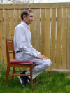 | 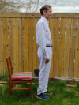 |  |
| extension | 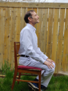 | 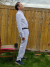 |  |

    When sitting, there isn't much difference in outward appearance, but I feel like I am arching my back. I cannot avoid lifting my chin, but the important part is to arch the back.

1. Rotate the wrist away from neutral
| action | before | after | evaluation |
|---|---|---|---|
| pronation (palm down) | 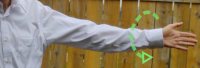 | 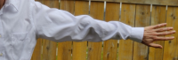 |  |
| neutral |  |  |  |
| supination (palm up) | 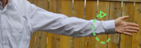 |  |  |
1. Pinky extension
| before | after | evaluation |
|---|---|---|
| 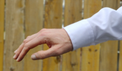 | 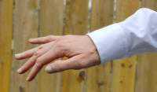 |  |

    The nearby fingers are hard to isolate from the pinky extension, but the pinky is what I'm thinking about.

### Sending

4. Wrist extension
| action | illustration | evaluation |
|---|---|---|
| extension | 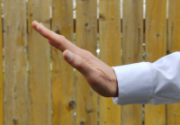 |  |
| neutral | 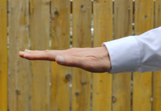 |  |
| flexion | 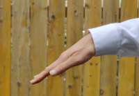 |  |
1. Palm direction   
Energy is emitted perpendicular to the palm surface. Your palm can be
aimed at the center of the salão, perpendicular to the center
of the salão (e.g. ceiling, floor, or along the circumference),
or back toward yourself.
In general, the most delicate direction is toward the center
of the salão because it can look as if you
are aiming across the salão at other people.
If you are aiming across the salão then you
must have consent; it should be an orchestrated collective action.
If you are aiming elsewhere then consent is less important.

## Pose Ensembles

None of these pose ensembles incorporate all of the components mentioned above,
but all of them incorporate some of the components. I also call out similar
poses that miss opportunities to improve the conductivity of reverence.

### Pose: Umbrella ☂️

| sitting | evaluation |
|---|---|
| 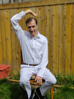 |  |

- Wrist and pinky extension
- Wrist pronation
- Palm facing ceiling

Variations:
- Both arms ("double umbrella"?). This is a great complement to The Lord's Prayer.
- Different angle (shoulder joint can rotate about 90 degrees so play with that)

Of course, it is challenging to keep an arm (or arms) elevated for a long duration,
but five minutes is feasible.

### Pose: Feather ruffle 🪶

Of course this is only feasible if you aren't holding anything in your hands.

| sitting | evaluation |
|---|---|
| 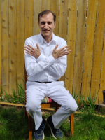 |  |

- Wrist and pinky extension
- Wrist supination
- Palm facing self

The wrist extension prevents my hands from touching my arms or the shirt.

Variation: Straighten the elbow joint and face the palms toward the floor with the wrists crossed.

### Pose: Classical worship

This is not really feasible to do in practice.
I include it here mainly to connect with tradition.

| sitting | standing | evaluation |
|---|---|---|
| 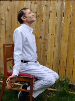 | 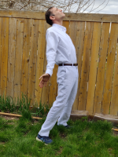 |  |

- Spine extension
- Wrist supination & extension
- Pinky extension
- Palm facing the center of the salão

While I feel the inner effect of the pose,
my external appearance looks a little bit odd (to me, at least :-).
Compare with some artistic renditions:

| sitting(-ish) | standing |
|---|---|
|  |  |

The man (left) is a speed painting by Lance Brown. 🤩
The woman (right) is a photo of artwork from the Ashland OR salão.
She lacks obvious spine extension, her wrist extension is faint, and her pinky extension is washed out by the flow of energy, but otherwise it is almost a great example.

| standing | evaluation |
|---|---|
| 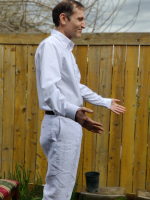 |  |

- Wrist neutral/flexion instead of extension
- Pinky neutral instead of extension
- No spine extension

The following pose is a minor variation (different arm position) but
otherwise the same idea:

| standing | evaluation |
|---|---|
| 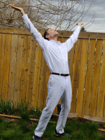 |  |

- Spine extension
- Wrist and pinky extension
- Palm facing ceiling

With hands raised, this pose is too taxing to hold for more than a brief time...unless you're a statue.

| front | side/front | side/back |
|---|---|---|
|  |  |  |

In celebration of [Yemanjá](https://en.wikipedia.org/wiki/Yem%E1%BB%8Dja), Ashland OR salão displayed this exquisite statue in 2023 & 2024.
Spine extension is clearly evident from the side/back perspective.
The right hand is balled in a fist, perhaps to hold a maraca (not sculpted).
The left hand is cupped (flexion not extension), but I'll cut the artist some slack.
Wow. 😍

### Pose: Holding a Flower 🥀

| concept | actual | evaluation |
|---|---|---|
| 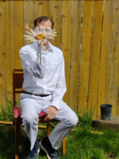 | 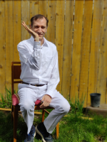 |  |

- Wrist and pinky extension
- Palm facing perpendicular to the center of the salão

In the concept image, there is a flower superimposed over my arm/hand.
Moving the fingers is like wiggling the petals.

Variation: By relaxing the humerus to a more neutral position, this gesture becomes a one-armed version of the [Añjali Mudrā](https://en.wikipedia.org/wiki/A%C3%B1jali_Mudr%C4%81).
It would look super cool if the whole congregation could coordinate on this gesture.

{}
Wide acceptance of the two-handed Añjali Mudrā is based on a misinterpretation.
The two-handed version is not the gesture.
Two people together assembling the Añjali Mudrā with one hand each is the gesture.
{}

## Standing-only Pose Ensembles

### Pose: Shark fin 🦈

| Pose | Evaluation |
|---|---|
| 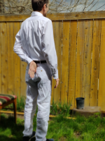 |  |
| 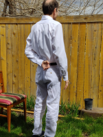 |  |

- Wrist and pinky extension
- Palm facing perpendicular to the center of the salão
- Spine extension

Variation: This posture is great for dancing works, but it can also be used when standing in non-dancing works.
If you face the center while your body is turned 90 degrees off center then you can also incorporate spine extension and hold the book in such a way as to obtain wrist extension (c.f., Holding a Flower).
It would look super cool if the whole congregation could coordinate on this stance, including the direction of the 90 degree turn.
We could flip orientations (chest facing left or right) between verses or hymns!

Warning: Do not attempt if you have a rotator cuff injury.

### Pose: Hands with opposite twist

Not sure where to incorporate this into a work...

| Closed | Open | evaluation |
|---|---|---|
| 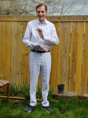 | 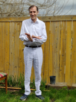 |  |

- One wrist supinated, the other pronated
- Wrist and pinky extension (at least one hand)
- Palm facing palm or perpendicular to the center of the salão (ceiling and floor)

The `open` and `closed` variations just indicate whether the palms are facing or not.

## Parody?

<iframe width="540" height="304" src="https://www.youtube.com/embed/TK2_ezOBa2A" title="Tim Hawkins on Hand Raising" frameborder="0" allow="accelerometer; autoplay; clipboard-write; encrypted-media; gyroscope; picture-in-picture; web-share" allowfullscreen></iframe>

## Notes

[^garrison2016]: In contrast, in an ordinary state of mind, pose seems to have little psychological effect. See Garrison, K. E., Tang, D., & Schmeichel, B. J. (2016). Embodying power: A preregistered replication and extension of the power pose effect. *Social Psychological and Personality Science, 7*(7), 623-630.
