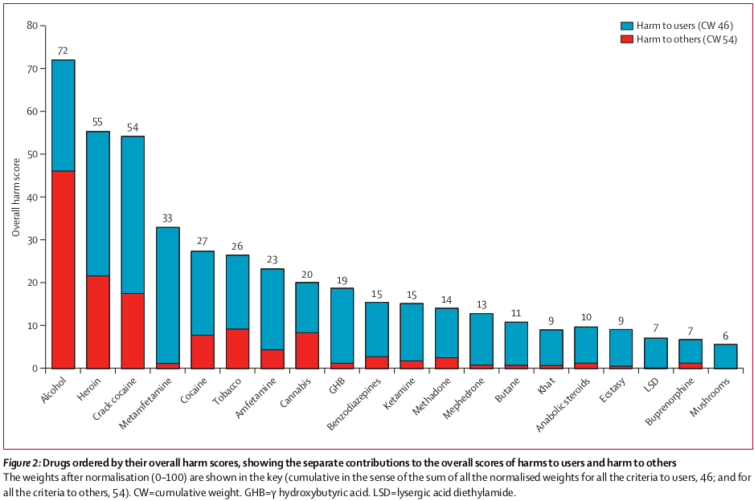

# Psychedelics



Nutt, D. J., King, L. A., & Phillips, L. D. (2010). Drug harms in the UK: a multicriteria decision analysis. *The Lancet, 376*(9752), 1558-1565.



## My experience

Psychedelics are substances that reveal and amplify your inner experience.

I have personal experience with:

*   Psilocybin
*   Salvia divinorum
*   Cannabis
*   Daime (a.k.a. ayahuasca)

I am also a member of the [Sacred Garden Church](https://sacredgarden.life/).


Psychedelics are not for everybody.

