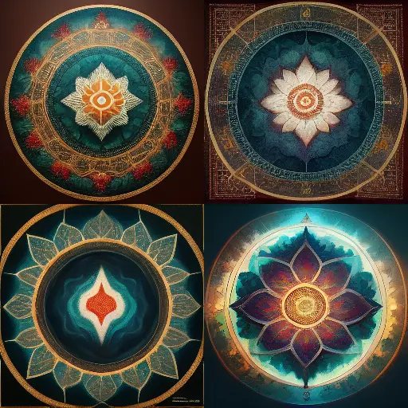

# Psychedelics



Nutt, D. J., King, L. A., & Phillips, L. D. (2010). Drug harms in the UK: a multicriteria decision analysis. *The Lancet, 376*(9752), 1558-1565.



{}

## My experience

Psychedelics are substances that reveal and amplify your inner experience.

I have personal experience with

*   Psilocybin
*   Salvia divinorum
*   Cannabis
*   Daime (a.k.a. ayahuasca)

I am a member of
- [Sacred Garden Church](https://sacredgarden.life/)
- [Santo Daime](https://en.wikipedia.org/wiki/Santo_Dai)[^catholic]


Psychedelics are not for everybody.


<--->

<table>
<tr>
<td>
<picture style="display: block;">

</picture>
</td>
<td class='rotate'>
Credit: Midjourney "sacred mandala"
</td>
</tr/>
</table>

{}

## Notes

[^catholic]: I am a bit embarrassed to be affiliated with Catholicism given its [sordid history](https://en.wikipedia.org/wiki/Catholic_Church). In general, I admire the best of all of the world's religions.
