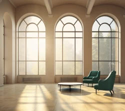
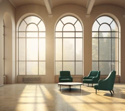

# Services

We gently help people turn toward their experience rather than away from it.

Clients typically come in feeling stuck, overwhelmed, or shut down. Over time, they find themselves reacting less, understanding themselves better, and moving through life with more ease. Relationships become less fraught. Old wounds lose their grip. The change is gradual—and then it isn't.

## What does counseling look like?

{}

### Individuals

As a default, I recommend 75-minute sessions every week.

{}
I have a part that is impatient to see you healed too. It's my job to balance impatience with the time that is required to heal injury.
{}

<--->

### Couples & Dyads

As a default, I recommend 90-minute sessions every week.

{}
I have a part that is impatient to see you healed too. It's my job to balance impatience with the time that is required to heal injury.
{}

{}

The duration and frequency of therapy can vary depending on your needs and motivation.
During the no-fee consultation, we'll decide together what is the best fit. 😃

## Location

I see clients by video 📹 or audio-only 🎙️.
For individual therapy, you may prefer audio-only ☎.[^audio-only]
When working with dyads, video is highly recommended.[^one-way-video]

I am Oregon-based (near California)[^native] and work with clients worldwide via video—no geographic restrictions. 🌎

## Notes

[^audio-only]: In the classical approach to psychotherapy, the client lies on a couch 🛋️ and does not look the therapist directly in the eye 👀 while speaking.

[^native]: I acknowledge that I live on the traditional
territory of the Shasta; Confederated Tribes of Siletz Indians;
Confederated Tribes of Grand Ronde; Cayuse, Umatilla and Walla Walla;
Cow Creek Umpqua; Takelma; and Modoc. See https://native-land.ca/

[^one-way-video]: If you find my face distracting then I can turn off
my video, but I need eyes on your video feeds to watch for nonverbal cues.
