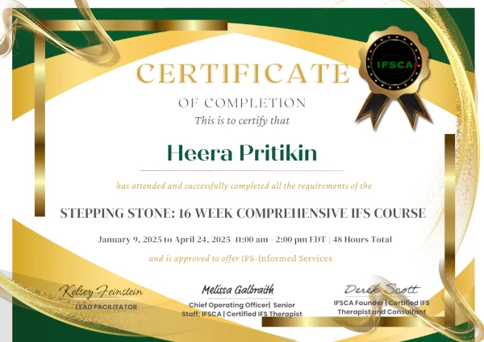

I work with adult individuals.

I provide *counseling* under [ORS 675.825(4)(a)](https://oregon.public.law/statutes/ors_675.825), which allows alternative counselors to practice legally in Oregon without a 🪪 license. Since I am **not** licensed in Oregon, I cannot describe myself 🤐 as a *psychotherapist*. [ORS 675.020](https://oregon.public.law/statutes/ors_675.020)

{}

## Booking

<form><input class="glowing" type="button" onclick="window.open('https://www.facebook.com/profile.php?id=100070331018313', '_blank')" value="Free Consultation" /></form>

 

<form><input class="glowing" type="button" onclick="window.open('https://www.facebook.com/profile.php?id=100070331018313', '_blank')" value="Book Appointment" /></form>

<--->

## Fees

I am working at a sliding scale rate or pro bono. Reserve time in 15 min increments. I do not accept insurance. 

{}

{}
  
{}

## Education

- IFS Informed (IFSCA Stepping Stone, completion Apr 2025)
- 1-on-1 and small group meditation instructor based on eastern yoga (30 yrs)
- Peer support specialist -- substance abuse ([THW](https://traditionalhealthworkerregistry.oregon.gov/Search) #107634)
- Peer support specialist -- mental health
- B.S. Foundations of Elementary Education in 2011 from University of Oregon 🎓
