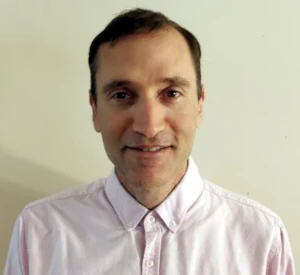
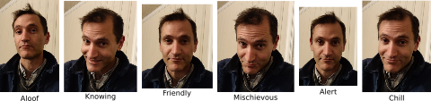

{}

<--->

Joshua works primarily with individuals and couples using IFS. He brings an unusually broad background to the work: a Ph.D. in quantitative psychology, more than 30 years of meditation practice, and deep reading in philosophy and religion. That breadth shapes how he listens—with patience, curiosity, and without a fixed agenda.

He is warm and direct. Sessions are unhurried. Clients often say they feel genuinely heard for the first time.

<a href=""></a>

{}

## Zoom link

{}
- I partner with [Hand in Hand Parenting](https://www.handinhandparenting.org/) for childrearing issues. 🧑‍🧒‍🧒 Is your child obedient, cooperative, and joyful? Learn how to navigate family dynamics with ease. I roleplay the parent and you roleplay your child.
- I practice as a counselor under Oregon law, which recognizes alternative counselors alongside licensed therapists.[^legal] IFS Certification is the relevant credential for this work.
{}
{}
- I have studied [nutrition](https://brambles.joshuapritikin.com/docs/health/) for many years and am trained to evaluate statistical evidence.
- I am **not** a licensed dietician.[^capture-of-nutrition]
- I am **not** a medical doctor.
{}
{}
- Prepare to take your first psychedelic journey safely[^morgan2020]
- Understand and integrate your psychedelic journey(s)
- I do **not** prescribe, procure, or administer substances. [You can do that yourself.]()
{}

{}

## Booking

<form><input class="glowing" type="button" onclick="window.open('https://joshua-pritikin.clientsecure.me/request/service', '_blank')" value="Free Consultation" /></form>

To sign in, enter your email—there's no password. If you don't receive the login email within five minutes, check your spam folder for `simplepractice.com`.

My schedule fills up; booking a few weeks ahead gets you your preferred time slot.

<form><input class="glowing" type="button" onclick="window.open('https://joshua-pritikin.clientsecure.me/sign-in', '_blank')" value="Returning Client Sign-In" /></form>

<--->

## Fees

My rate is **$100 per hour**. Reserve time in 15-minute increments. I do not accept insurance.

Sliding scale rates are available for people with low income, veterans, and active military—just ask.

This includes non-emergency support via text messages.[^emergency] I respond within 24 hours, but often sooner.

{}

{}
Make rapid progress with an intensive. Reach out to schedule eight or more hours per week.
{}

## Background & Training

{}
| Date | Description |
|------|-------------|
| (goal) | [IFS Approved Clinical Consultant](https://ifs-institute.com/trainings/ifs-certification/approved-clinical-consultants) |
| 2026 Apr | IFS Level 3 |
| 2025 Apr | Program Assistant Development Workshop |
| 2024 Jul | [IFS Certified Practitioner]() |
| 2024 Feb | IFS and Past Lives with Bob Falconer |
| 2023 Dec | [Common Stuck Points](https://burriscounseling.com/) |
| 2023 Nov | IFIO Advanced Training: Sexuality Matters |
| 2023 Aug | [Creating Healing Circles](https://burriscounseling.com): Using the IFS Model in Group Therapy |
| 2023 Jun | [Intimacy from the Inside Out](https://www.toniherbineblank.com/trainings.html) (IFIO) relationship therapy Basic Training (IFS Level 2) |
| 2022 Nov | IFS Level 1 🍀🚀 |
| 2022 Sep to present | [IFS Continuity Program](https://learn.ifs-institute.com/ifs-continuity-program/) |
{}
{}
- Check out my [2023 article on meditation](https://partsandself.org/ifs-and-meditation/) published in the IFS magazine PARTS & SELF!
- Can provide cult recovery support.
{}
{}
- See [NCBI](https://www.ncbi.nlm.nih.gov/sites/myncbi/1JSuQtfn5RykSS/bibliography/56367505/public/?sort=date&direction=ascending) for publications.
{}

## Me Online

{}
- [IFS Institute](https://ifs-institute.com/practitioners/all/110287)
- [Intimacy From the Inside Out (IFIO) Directory](https://www.toniherbineblank.com/therapist-directory.html)
- [Parts Work Directory](https://partsworkdirectory.com/listing/joshua-pritikin-counseling.html)
- [psychedelic.support](https://psychedelic.support/network/joshua-pritikin-phd/)
- [The Third Wave](https://directory.thethirdwave.co/therapists/internal-family-systems-therapy-ifs/oregon/joshua-pritikin/)
- [Psychable](https://psychable.com/practitioners/internal-family-system-practitioner)
{}

{}

<table>
<tr>
<td>
<picture style="display: block;">
    <source media="(min-width: 1320px)" srcset="line-up-1280.png">
    <source media="(min-width: 840px)" srcset="line-up-800.png">
    
</picture>
</td>
<td class='rotate'>
Dec 2019
</td>
</tr></table>

{}

{}
If this page has left you insatiably curious about Joshua Pritikin as a person, [Brambles](https://brambles.joshuapritikin.com/) exists. Manage expectations accordingly: lower them.
{}

## Notes

[^capture-of-nutrition]: Is it probably a good thing that I am not a licensed dietician given [The corporate capture of the nutrition profession in the USA: the case of the Academy of Nutrition and Dietetics (2022)](https://www.cambridge.org/core/journals/public-health-nutrition/article/corporate-capture-of-the-nutrition-profession-in-the-usa-the-case-of-the-academy-of-nutrition-and-dietetics/9FCF66087DFD5661DF1AF2AD54DA0DF9).

[^morgan2020]: Morgan, N. L. (2020). Integrating psychedelic experiences utilizing the Internal Family Systems therapeutic model. *Int. J. Soc. Sci. Manage. Rev 3,* 257–264. doi: [10.37602/IJSSMR.2020.3417](http://ijssmr.org/uploads2020/ijssmr03_123.pdf)

[^legal]: I provide counseling under [ORS 675.825(4)(a)](https://oregon.public.law/statutes/ors_675.825). As an unlicensed counselor I cannot use the title *psychotherapist* ([ORS 675.020](https://oregon.public.law/statutes/ors_675.020)), but I am legally authorized to practice in Oregon.

[^emergency]: [Go here for emergency support.]()
