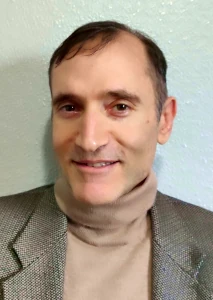

{}

<--->

## Zoom link

{}

{}
- [IFS is similar to psychotherapy, addressing many of the same conditions.]()
- I partner with [Hand in Hand Parenting](https://www.handinhandparenting.org/) for childrearing issues. 🧑‍🧒‍🧒 Is your child obedient, cooperative, and joyful? Learn how to navigate family dynamics with ease. I roleplay the parent and you roleplay your child.
- I provide *counseling* under [ORS 675.825(4)(a)](https://oregon.public.law/statutes/ors_675.825), which allows alternative counselors to practice legally in Oregon without a 🪪 license. Since I am **not** licensed in Oregon, I cannot describe myself 🤐 as a *psychotherapist*. [ORS 675.020](https://oregon.public.law/statutes/ors_675.020)
{}
{}
- Prepare to take your first psychedelic journey safely[^morgan2020]
- Understand and integrate your psychedelic journey(s)
- I do **not** prescribe, procure, or administer substances.
{}
{}
- I have studied [nutrition]() for many years and am trained to evaluate statistical evidence.
- I am **not** a licensed dietician.[^capture-of-nutrition]
- I am **not** a medical doctor.
{}

{}

## Booking

<form><input class="glowing" type="button" onclick="window.open('https://joshua-pritikin.clientsecure.me/request/service', '_blank')" value="Free Consultation" /></form>

{}
{}
  - Enter your email address to *Sign in*. There is no password. If you don't receive the email invitation to login within five minutes, check your spam folder for `simplepractice.com`.
  - Book a month in advance to ensure that you get your preferred time slots before my schedule fills up.
{}
{}

<form><input class="glowing" type="button" onclick="window.open('https://joshua-pritikin.clientsecure.me/sign-in', '_blank')" value="Book Appointment" /></form>

<--->

## Fees

My rate is **$100 per hour**. Reserve time in 15 min increments. I do not accept insurance. 🎟️

This includes non-emergency support via text messages.[^emergency] I respond within 24 hours, but often sooner.

{}
I have no educational debt. I own a home. My daughter's college education is mostly paid for.
Don't assume I lack expertise just because I'm not charging market rate.
If you insist on paying me $250/hr, I will accept it.
{}

{}
People with low income 🎱, or veterans or active military 🎖️ may request a sliding scale rate.
{}

{}

{}
{}
I get attached to my clients. If we haven't had an appointment for more than 6 months then you can receive a free hour.

1. Make the booking as usual.
2. Let me know that you wish to avail this offer during the session.
{}
{}

## Education

{}
| Date | Description |
|------|-------------|
| 2025 Apr | Program Assistant Development Workshop |
| 2024 Jul | [IFS Certified Practitioner]() |
| 2024 Feb | IFS and Past Lives with Bob Falconer |
| 2023 Dec | [Common Stuck Points](https://burriscounseling.com/) |
| 2023 Nov | IFIO Advanced Training: Sexuality Matters |
| 2023 Aug | [Creating Healing Circles](https://burriscounseling.com): Using the IFS Model in Group Therapy |
| 2023 Jun | [Intimacy from the Inside Out](https://www.toniherbineblank.com/trainings.html) (IFIO) relationship therapy Basic Training (IFS Level 2) |
| 2022 Nov | IFS Level 1 🍀🚀 |
| 2022 Sep to present | [IFS Continuity Program](https://learn.ifs-institute.com/ifs-continuity-program/) |
{}
{}
- Check out my [2023 article on meditation](https://partsandself.org/ifs-and-meditation/) published in the IFS magazine PARTS & SELF!
- Can provide cult recovery support.
{}
{}
- See [NCBI](https://www.ncbi.nlm.nih.gov/sites/myncbi/1JSuQtfn5RykSS/bibliography/56367505/public/?sort=date&direction=ascending) for publications.
{}

## Endorsements

{}
{}
- I cannot solicit endorsements or testimonials from current clients. Such a request would violate ethical codes. It poses a risk of subjecting vulnerable individuals to coercion.

- I hereby declare that I have not solicited the following endorsements.
{}
{}

- [Lyndsay MacPherson](https://www.facebook.com/groups/381892294305724/posts/505489025279383/?comment_id=505680095260276)

## Books

{}

In his groundbreaking new book, Joshua Pritikin explores the provocative idea that belief systems obstruct authentic religious experience. Building on James Carse's foundational work, "The Way" takes this premise to its logical conclusion, offering a methodical investigation into what religion might look like when freed from the constraints of belief.

[Get notified]()

<--->

{}

{}

This transformative book reveals the crucial distinction between religion and belief systems. While rigid beliefs often lead to division, true religion thrives on mystery and openness to the unknown. Drawing from historical examples and world traditions, it shows how embracing "higher ignorance"—knowing the limits of what we can know—creates space for genuine spiritual exploration. For anyone seeking wisdom beyond dogma in our polarized world, this book offers a refreshing path forward.

Carse, J. P. (2025). [*The religious case against belief*](https://carse-2025.pritikin.eth.limo/docs/intro/) (J. N. Pritikin, Trans.; 2nd ed.). Ethswarm.org (Original work published 2008)

<--->

{}

## Silly Photos

<table>
<tr>
<td>
<picture style="display: block;">
    <source media="(min-width: 1320px)" srcset="line-up-1280.png">
    <source media="(min-width: 840px)" srcset="line-up-800.png">
    
</picture>
</td>
<td class='rotate'>
Dec 2019
</td>
</tr></table>

## Notes

[^capture-of-nutrition]: Is it probably a good thing that I am not a licensed dietician given [The corporate capture of the nutrition profession in the USA: the case of the Academy of Nutrition and Dietetics (2022)](https://www.cambridge.org/core/journals/public-health-nutrition/article/corporate-capture-of-the-nutrition-profession-in-the-usa-the-case-of-the-academy-of-nutrition-and-dietetics/9FCF66087DFD5661DF1AF2AD54DA0DF9).

[^morgan2020]: Morgan, N. L. (2020). Integrating psychedelic experiences utilizing the Internal Family Systems therapeutic model. *Int. J. Soc. Sci. Manage. Rev 3,* 257–264. doi: [10.37602/IJSSMR.2020.3417](http://ijssmr.org/uploads2020/ijssmr03_123.pdf)

[^emergency]: [Go here for emergency support.]()
