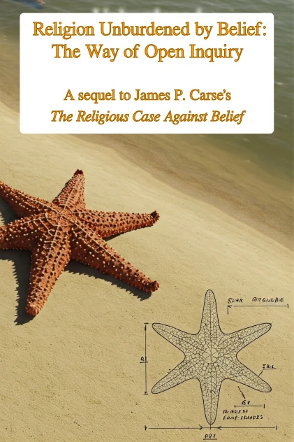

# Anticipating a new book release!

 

Coming soon!

In his groundbreaking new book, Joshua Pritikin explores the provocative idea that belief systems obstruct authentic religious experience. Building on James Carse's foundational work, "The Way" takes this premise to its logical conclusion, offering a methodical investigation into what religion might look like when freed from the constraints of belief.

Pritikin masterfully integrates diverse traditions—from ancient shamanic practices to contemporary psychological frameworks like Internal Family Systems therapy—to create a practical roadmap for direct religious experience. The book guides readers through meditation techniques, community ceremonies, and altered states of consciousness while maintaining a critical stance toward intermediaries who claim special access to religious truth. "The Way" invites readers to step beyond dogma into a more authentic engagement with life's profound mysteries.

  

    <button id="toc-toggle-btn" class="toc-toggle-button">Show Chapters</button>
  

  

    <h2 class="toc-heading">Chapters</h2>
    <!-- Chapters will be loaded here -->
  

  

    <h2 class="toc-heading" id="toc-current-chapter">Select a chapter</h2>
    <!-- Sections will be loaded here -->
  

 

  <h2 class="signup-title">Stay Connected</h2>
  
Sign up to receive updates about this book release and indicate your interest in becoming an Advanced Reader.

   

   
  

   

    <h3>Early Access</h3>
    
ARC readers get the book weeks before release

   

   

   <h3>Share Feedback</h3>
    
Help improve the final version

   

   

    <h3>Stay Informed</h3>
    
Be the first to know when the book launches

   

  

   
  

   
Expected Release: TBD

  

 

